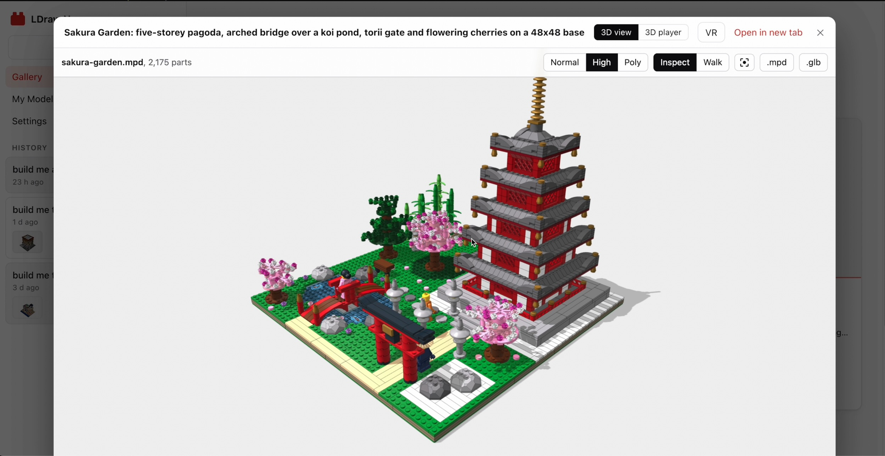
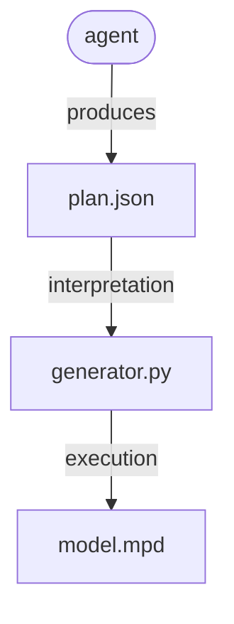

# ldraw-nova

**Give an AI agent a model idea. Guide it, let it build it, and get an LDraw LEGO© model.**

What you get when the building process finishes:

- Its **source code**, in **[LDraw language](https://www.ldraw.org/)**.
- **Different views:** 3D viewer, 3D player, VR interactive (Meta Quest 3), images...
- **Blender editable** glTF file, in `.glb` format, metainfo as Blender's Custom Properties.
- **Chat history** and **agent thinking process**.
- and more... 👌

Take a look at [the video](https://youtu.be/YDjjxGqWpgU):

[](https://youtu.be/YDjjxGqWpgU)

## Installation


> [!IMPORTANT]
> **Tools** used by agents in order to find **suitable parts** and **example models** take advantage of [jev-rerank](https://github.com/anteloc/jev-rerank) (I'm also the author). 
> This is a **semantic search tool** with **re-ranking** backed by [TypeSafe](https://typesafe.ai/)'s [Jev System One](https://typesafe.ai/) AI model.
> 
> - **If you have a TypeSafe API key** (`TYPESAFE_API_KEY`), set its value on the web app's **Settings** section.
> - **If you don't**, reranking search **will not work**, and agents will resort to a **FTS (Full Text Search)** strategy as a fallback, which could (maybe) yield **worse models.**

Run **ldraw-nova** as a web app, with Docker. You need [Git](https://git-scm.com/downloads) and [Docker](https://docs.docker.com/get-started/get-docker/).

This web app will run dockerized, and to build the Docker image, two sibling repos are required:

- [`ldraw-nova`](https://github.com/anteloc/ldraw-nova): this one, of course 😉
- [`ldraw-nova-docker`](https://github.com/anteloc/ldraw-nova-docker): provides both Docker configuration and the web app.

**1. Clone** both repos side by side, at the **same tag**, so they work together:

```bash
git clone --branch v0.6.0 https://github.com/anteloc/ldraw-nova.git
git clone --branch v0.6.0 https://github.com/anteloc/ldraw-nova-docker.git
```

**2. Build** the Docker image. The first build takes a while and needs about 5 GB of disk space:

```bash
cd ldraw-nova-docker
docker compose build
```

**3. Start** the app:

```bash
docker compose up -d
```

**4. Open** it in your browser:

- **https://localhost:8443**: needed for VR on Meta Quest 3. The certificate is self-signed, so accept the browser's warning the first time.
- **http://localhost:8765**: plain HTTP, no certificate warnings. Use it if the self-signed certificate gets in the way. VR won't work over it.

Other devices on your network can reach the app by your computer's IP instead of `localhost`, e.g. `https://192.168.1.20:8443` from a Quest 3. The app has no login, so only run it on networks you trust.

To stop it: 

```bash
docker compose down
```

## Why all of this?

Well, to summarize: I did this in order to get **agentic LLMs capable of designing buildable, physical things!**

Finding **LDraw**, an **assembly language** (pun intended! 😜) that would be at the same time **simple**, **low level**, and **executable** in order to **produce 3D CAD models**, gave me the idea of **experimenting** with both **ChatGPT** and **Claude** in order to try and make them **code in LDraw**, same as they do with other programming languages.

To my surprise, even though this language is heavily focused on **math** (parts rotations, positioning...), which LLMs are **usually bad** at, **agents did pretty well** instead on initial tests, and subsequent projects also yielded **good results**, but **never enough** in order to consider generated models to be correct:

- **Initial research:** [ldbuilder-ai](https://github.com/anteloc/ldbuilder-ai)
- **1st attempt** at an agentic python tooling: [py2bricks](https://github.com/anteloc/py2bricks)
- **2nd attempt**: [py4bricks](https://github.com/anteloc/py4bricks)

These three attempts, and quite some other experimentation, led me to the following **conclusions**:

**💡 Conclusion 1:** there is a **minimum resistance path to geometry math** for agents, i.e.:

- **Giving the agents tooling** to generate LDraw sources would **sidestep (evil!) geometry math**
- ... because they do way **better** at generating **python code** that **produces math**
- ... **than on producing math themselves!**

**💡 Conclusion 2:** 

- Agents tend to do **better when learning** from python **code** that **produces models**
- ... than from **models themselves** (LDraw's evil geometry, again...)

Then, the **only thing left 🤔** was to create a python-based tooling with the required **primitives, verbs, constructive vocabulary**... so agents would **learn by example** and **do similar things on their own.**

Which proved to be really **hard to get right**, even if vibe coding it... until **GPT-6 Astra** and **Claude Opus 5.5** arrived... and **vibe-coded it right!** 🚀🚀🚀

## How it works

**ldraw-nova** provides the tools, examples and instructions an agent needs to design models with real LDraw parts. 

The process is as follows:

1. The agent takes a **prompt**.
2. **Reads** [instructions.md](./instructions.md) and related documents to [LDraw language](https://www.ldraw.org/) and LEGO© models building.
3. **Plans** how to build the model: required parts, submodels to be created, aesthetics...
4. **Iteratively**:
	1. Renders images from the model/submodel(s)
	2. Inspects them, adjusts positioning, aesthetics... and back to rendering
5. ... until it considers the **model finished** and ready to deliver!

Provided tooling helps the agent in:

- **Finding** suitable parts.
- Also, **example models** and **submodels** to start with.
- **Collision** and **gaps detection** for placing parts correctly.
- **Headless rendering** for inspecting current results.
- and more...

The agent **doesn't actually start with placing parts**, except for things like e.g. prototyping and learning by altering pre-existing example models.

The way it produces models is more like:

- **Collects** the required information, from experimental results, docs and planning.
- **Builds** one or more **plans**, that fully describe the model and submodels, including its geometry, like e.g. [atlas-crane.plan.json](examples/atlas-crane/atlas-crane.plan.json)
- And with that plan, it creates one or more **generator scripts** like e.g. [generate.py](examples/atlas-crane/generate.py) 
- ... that when executed, **produce LDraw source** file(s), a very specialized **3D CAD language**.
- ... like e.g. [atlas-crane.mpd](examples/atlas-crane/atlas-crane.mpd)

To **summarize**, this is like:

- an **agent** creating a **generator** 
- ... that produces a **3D model** 
- ... in an **assembly language** named **LDraw** 🤯

A **compiler** of sorts, so to say 🤓





## Agent's informational sources

These are some of the guides and references given to the agent in order to make it a builder:

| I want to…                            | Read…                                                                                                              |
| ------------------------------------- | ------------------------------------------------------------------------------------------------------------------ |
| Ask an agent to generate a model      | [Agent instructions](instructions.md)                                                                              |
| Improve shape, colour and detail      | [Visual design guide](docs/agent/visual-design.md)                                                                 |
| Build vehicles                        | [Vehicle workflow](docs/agent/vehicles.md) and [examples](examples/vehicle-atlas/README.md)                        |
| Build advanced spaceships             | [Spaceship workflow](docs/agent/spaceships.md) and [atlas](examples/spaceship-atlas/README.md)                     |
| Learn a submodel and grow an atlas    | [Build-manual workflow](docs/agent/build-manuals.md)                                                               |
| Build Technic structures              | [Structural workflow](docs/agent/technic.md) and [examples](examples/technic-atlas/README.md)                      |
| Design creative Technic models        | [Design patterns](docs/agent/technic-design.md) and [Mecha construction studies](examples/technic-studies/README.md) |
| Build with mechanisms                 | [Mechanism workflow](docs/agent/mechanisms.md) and [build manuals](examples/mechanism-atlas/README.md)             |
| Find parts and reusable constructions | [Reference discovery](docs/agent/reference-discovery.md) and [reference atlas](examples/reference-atlas/README.md) |
| Organize a large model                | [Module workflow](docs/agent/complex-models.md) and [Copper Lane example](examples/modular-street/README.md)       |
| Understand connections and checks     | [Geometry](docs/agent/geometry.md), [snapping](docs/agent/snapping.md) and [validation](docs/agent/validation.md)  |
| Look up a command or file-format rule | [Tool reference](docs/agent/tooling.md) and [LDraw rules](docs/agent/ldraw-reference.md)                           |

## Development

Being this a **first release**, there are quite some things that still require some work:

- **VR on Meta Quest 3:** model handling has **many issues**, performance issues.
- **Adapt for low-end agents:** adapt current tooling, docs and instructions in order to improve usage by low-end models like e.g. Luna, Haiku, etc.
- **Expensive generation:** currently, only **expensive**, high-end models, are currently capable of generating large-sized and correct models.
- **Improve efficiency:** generative process is currently slow.
- **Add and improve** more **model families:** 
	- Humans and animals: minifigs
	- Technic models: machines, engines... 
	- Spaceships: generated models are not very good
- **Building models from manuals:** it partially works, better if page manuals are given as images.
- **Fine-grained inspection:** for inspecting submodels and their step-by-step building processes.

## Contributing

COMING SOON

## Acknowledgements

I'd like to thank the following:

- [The LDraw Community](https://www.ldraw.org/)
- [LDView](https://tcobbs.github.io/ldview/)'s Travis Cobbs (@tcobbs), and contributors.
- [LeoCAD](https://github.com/leozide/leocad)'s Leonardo Zide (@leozide), and contributors.
- [LDCad](https://www.melkert.net/LDCad) and Shadow Library, Roland Melkert.
- [ldraw.rs](https://github.com/segfault87/ldraw.rs)'s Park Joon-Kyu (@segfault87), and contributors.
- [pyldraw3](https://github.com/hbmartin/pyldraw3)'s  Harold Martin (@hbmartin), and contributors.

... and thanks to all of the many other LDraw creators!

**NOTE:** For this work, I've used many LDraw models, libraries, tools, docs... from many sources.

There is a lot **amazing people** that generously contributed to this, even for **decades**, by **generously donating their finest work** to the public domain and open source community. 

If you think you should be included on this section, please **drop me an email!**

## Trademarks

**LEGO(R)** is a trademark of the **LEGO Group** of companies which does not sponsor, authorize or endorse this software.
