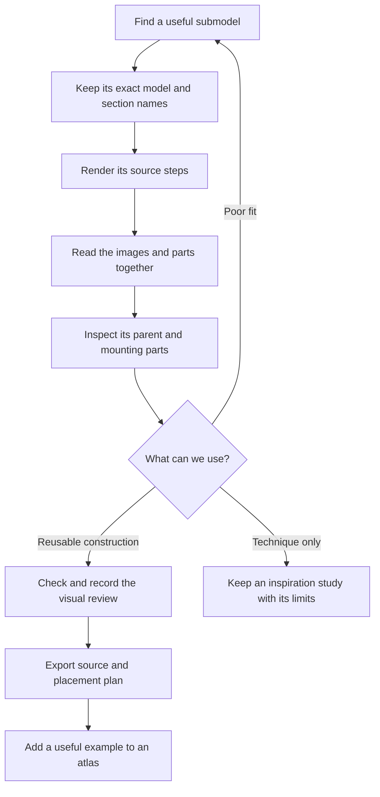

# Learn a construction from its build pages

Use this workflow whenever a useful submodel is hard to understand from its finished picture. It applies to **every atlas**: buildings, vehicles, Technic structures, mechanisms, spaceships and general references. A source MPD supplies exact parts and placements; consecutive step images reveal how those placements form an assembly.



## 1. Find and identify the source

Follow the [Jev availability check](reference-discovery.md#check-jev-availability-before-searching). Query `SUBMODELS_DESCRIPTIONS_JEV.full_description` for one construction role, or use `discover search submodels ... --engine fts` when Jev is unavailable. Whole-model searches help find the intended scale, silhouette and surrounding structure; part searches then reveal the dedicated pieces used by the chosen construction.

Keep the **exact returned model filename and submodel section name**, original source hash, query and result identity. They are different identifiers. A name such as `75181 - Y-Wing Starfighter - step254-261.ldr` is a FILE section inside `75181-1.mpd`, not necessarily a separate disk file.

Read sources from `data/models-annotated/`. Inspect the section's physical BOM and parent placements. Skip empty sections, embedded part definitions and unresolved primitive-based pseudo-parts. Keep the original library files unchanged.

## 2. Prepare build pages

```sh
./ldraw-agent manual prepare \
  "data/models-annotated/75181-1.mpd" \
  --section '75181 - Y-Wing Starfighter - step254-261.ldr' \
  --outdir output/armour-study --views home top \
  --title 'Contoured spacecraft armour' \
  --notes output/armour-notes.json \
  --normalize-rotations --repair-bfc-comments
```

`--notes` is optional during initial exploration. Its JSON contains five text fields: `lesson`, `construction`, `interfaces`, `parent_context` and `reuse_notes`. Populate them before exporting. Describe what the pages and source actually establish; explicitly identify unresolved interfaces.

To complete a preliminary study, write those five fields to a separate notes file and prepare again with `--force --notes FILE`. Open the refreshed pages before recording review. Direct edits to hashed evidence correctly invalidate an earlier review.

The tool extracts a dependency-closed, attributed source; retains embedded DAT parts; and creates an offline `index.html` with section, step and viewpoint selectors. New parts have yellow outlines. Each page lists placements added by that source STEP group, including subassembly callouts. Each child assembly has its own sequence. A physical BOM counts the underlying parts separately.

Source step numbers are retained, empty groups are omitted and the final group is included even without a trailing STEP. No intermediate steps are invented: a one-group source produces one page. A constant camera keeps the completed assembly's full envelope visible throughout a sequence. Inspect a second view if additions are concealed.

`--overview` instead renders completed-model views and keeps section/step metadata for choosing smaller studies. Use it for large whole-ship or building precedents; it is **not a rendered build manual**. `--no-render` prepares source and metadata with image review and rendered BOM comparison pending. `--force` refreshes an existing study and invalidates its review.

For mechanism-specific operation notes, use `mechanism prepare` and the [mechanism workflow](mechanisms.md). It shares the rendering engine but records fixed/moving parts and input/output roles. Analytical mechanism verification remains deferred.

### Using the installed shell script directly

First run the globally available `ldraw-render-steps.sh` with no arguments and read its current help. It works on reference models and your own unfinished MPDs. For the version used here:

```sh
mkdir -p output/direct-armour-steps
ldraw-render-steps.sh \
  --libpath "${LDRAW_DIR:-$LDRAWDIR}" \
  --submodel '75181 - Y-Wing Starfighter - step254-261.ldr' \
  --from 1 --to 7 --viewpoint home --highlight \
  --image output/direct-armour-steps/armour.png \
  "data/models-annotated/75181-1.mpd"
```

Choose the actual last source step; do not merely count STEP separators, which can miss an unterminated final group. The script produces numbered images. Repeat with another viewpoint and basename as needed. Use `manual prepare` for the catalog workflow: it also supplies provenance, part lists, stable framing, embedded-part handling, freshness checks and review records.

### Inspect a model during construction

Use step images while building, before a model is ready for an atlas. Select the unfinished FILE section, render its current steps from home, front, side and top views, and follow each addition. This can reveal the first step with a misplaced part, a hidden gap, missing support, uneven armour or an awkward silhouette.

For example, after checking that `hull.ldr` has four source steps:

```sh
mkdir -p output/my-ship/step-review
for view in home front right top; do
  ldraw-render-steps.sh \
    --libpath "${LDRAW_DIR:-$LDRAWDIR}" \
    --submodel 'hull.ldr' --from 1 --to 4 \
    --viewpoint "$view" --highlight \
    --image "output/my-ship/step-review/hull-$view.png" \
    output/my-ship/my-ship.mpd
done
```

Use the actual section name and supported step range for your source. Open the numbered images and compare the same step across views. Fix the responsible placement in the plan or generator, rebuild, then render the affected sequence and finished model again. Inspect its parent too: a submodel can look correct alone and interfere with surrounding parts.

Step images show only the steps authored in the source; they do not create a build order for a one-step submodel or prove physical fit. If the shell script omits a final group or embedded part, use `manual prepare` for the integrated handling described above.

## 3. Read the pages as a manual

Start with the finished assembly, then return to the first page. Follow additions in order and compare the part list with the highlighted shapes. Identify dedicated parts, plate bonds, hinge halves, axle stacks, braces, attachment surfaces and deliberate gaps. Inspect the source when a length, orientation or connection is unclear.

Check the containing parent: it may supply an absent pinion, canopy, floor, opposite wing or support frame. Source coordinates can point in any direction, and a local origin is not automatically a useful connector. Record the required mounting pieces, physical envelope, source axes and what must change in the new model.

A source STEP group can add hidden internals and their enclosure simultaneously. Switch views, inspect its child sections or read the exact placements; do not claim the images reveal an insertion that they never show. Likewise, a rendered sequence and its MPD share the same source assumptions. They teach a construction without independently proving it is physically buildable.

## 4. Review, export and add to an atlas

Open every generated step/view and final preview, then record their exact relative filenames from `manual.json`:

```sh
./ldraw-agent manual review output/armour-study \
  --images manual/00/step-001-home.png ... renders/home.png \
  --note 'Describe what was inspected, the useful technique, parent dependencies and any limits.'
./ldraw-agent manual export output/armour-study --outdir output/new-armour-example
```

Replace `...` with the **complete list actually opened**. Reviews bind the current source, notes, checks and images by hash. Export requires passing source checks, a matching Python/LeoCAD BOM, populated study notes and current visual review. Keep invalid sources as labeled inspiration studies; do not promote them to reusable assemblies merely because they render nicely.

For an atlas addition:

1. Choose its family and whether it is a whole-model example or a reusable detail. Prefer a distinct technique, useful scale or new attachment pattern over another near-duplicate colour variant.
2. Add its exact source identity/hash, discovery evidence, viewpoints, lesson and interface notes to that atlas's selection manifest. Include an explicit generator only when it adds reproducible adaptation; an unchanged source already has an extraction manifest and editable placement plan.
3. Follow that atlas's generator and catalog format. The [spaceship generator](../../examples/spaceship-atlas/generate.py) demonstrates whole-model overviews, build manuals, recorded copy repairs and separate inspiration entries. Reference-library cards keep their existing `discover` preparation/review workflow.
4. Add catalog paths relative to the atlas directory: `model`, `plan`, `guide`, `manual`, `preview`, study notes and visual review. Use `examples` for whole models and `details` for smaller constructions where the atlas supports both. Link the new entry from its README/gallery.
5. Exercise discovery/listing and export; rebuild the copied plan, compare its BOM, and check local links. After adapting its geometry, regenerate affected checks and images and review the final revision again.

Do not create a second parser or a Python translation of every source placement just to preserve an unchanged submodel. Keep the original attributed MPD and use the shared tooling. Parameterize dimensions, layouts or part families when there is a real design benefit.
