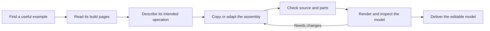

# Build models with mechanisms

Stage 2 is authorized for **construction from studied examples**: discover mechanisms, understand their parts and intended operation, then reuse or adapt them in new LDraw models. **Analytical mechanism verification is deferred at the user's request.** Do not require motion simulation, transmission calculations or physical testing to finish this workflow. Keep normal file, part, transform, geometry, BOM and visual checks, and describe operation as intended or inferred rather than verified.

Start with the [mechanism atlas](../../examples/mechanism-atlas/README.md). Its six studies cover gears, a worm drive, a steering rack, a piston/crank, a differential and a driven turntable. They include attributed source, build pages, per-step parts, parent placements, operation notes and an editable placement plan. The [structural workflow](technic.md) still applies to fixed chassis and supports.

For additional construction knowledge, read [creative Technic design](technic-design.md) and the [Mecha studies](../../examples/technic-studies/README.md). They add measured patterns for multi-crank engines, suspension, steering, Cardan shafts, selectors and four-bar lifts. Read their source qualifications before adapting them; these notes are separate from the atlas's reviewed exportable manuals.

Six of these patterns also have [portable Technic-atlas studies](../../examples/technic-atlas/README.md#mechanisms-from-ldraw-mecha), including actual source, pages and operation notes. Use `examples --family technic --limit 20` to find them and `mechanism export examples/technic-atlas/mechanisms/NAME --outdir output/my-study` to reuse a reviewed directory. Their guides identify missing parent interfaces and the recorded duplicate-axle repair in the four-speed core.



The same source-step method can grow every atlas. See the [general build-manual workflow](build-manuals.md) and `manual prepare` for buildings, vehicles, spaceships and other constructions without mechanism-specific operation fields.

## Choose the right construction

```sh
./ldraw-agent mechanism list
./ldraw-agent examples --family mechanism
./ldraw-agent examples --family mechanism differential
```

Open the example's `index.html` to move through steps and switch viewpoints. Open its `GUIDE.md` and `operation.json` before reuse. Compare its size, input/output locations, support frame, shaft directions and available attachment space with the new model's brief. A rack carriage may need a pinion from its parent; a gearbox section may expose interfaces whose roles are only clear in the complete transmission.

For other subjects, first perform the [Jev availability check](reference-discovery.md#check-jev-availability-before-searching), then query one role at a time:

```sh
./ldraw-agent discover search submodels 'a compact worm drive for a winch' \
  --construction mechanism --engine jev --max-parts 150 --limit 5 \
  --report output/winch-candidates.json
```

If Jev is unavailable, use the same command with `--engine fts` and state that it is offline keyword ranking. `--construction mechanism` uses the selected description and BOM as discovery filters; it does not establish that the result is complete or functional. `--construction all` remains useful for broad searches. Do not reject a useful assembly because its parent belongs to a different theme.

## Turn a source into build pages

Keep the exact returned model filename and section name. Use the annotated models under `data/models-annotated/`. For example:

```sh
./ldraw-agent mechanism prepare \
  "data/models-annotated/42042-1_Tower-Crane.mpd" \
  --section '42042 - spoolwormgear.ldr' \
  --title 'Worm-drive support module' --outdir output/my-worm-study \
  --views home top --normalize-rotations --repair-bfc-comments
```

Preparation uses the same LeoCAD step-export switches as `ldraw-render-steps.sh`. It handles embedded DAT parts, paths with spaces, source steps without a trailing STEP and dependency sections. Each assembly gets its own sequence; a child assembly stays a subassembly callout instead of being mistaken for one physical part. Empty groups are omitted from the pages while source step numbers are retained. No steps are invented when the source only has one group.

The optional repair flags make recorded changes to an extracted copy. Originals remain unchanged. `source.mpd`, `extraction.json`, `source-checks.json`, `bom.json`, `scene.plan.json`, `manual.json` and `index.html` retain the evidence. The default explicit preview colour is 7; source colour inheritance is preserved. `--no-render` prepares source/data for inspection but leaves visual review and rendered BOM comparison pending. `--force` intentionally refreshes an existing study and invalidates its review.

## Study the pages and record what they teach

Follow the additions in each step: exact parts, layer order, shafts, bushes, couplings, toothed faces and the support structure. Switch views when new parts are hidden. Read the source for lengths, tooth counts, part variants and transforms. Keep dedicated gear, rack, crank, piston, cylinder, differential and turntable parts where the reference uses them.

Write an operation-notes JSON file with these text fields, and pass it through `--operation FILE` when preparing the study:

- `function`: the intended function and where it is used.
- `fixed`: the supporting structure.
- `moving`: the pieces or groups intended to move.
- `input` and `output`: the intended drive and result; say explicitly when a role is unresolved.
- `parent_context`: missing supports, drive parts or mating mechanisms supplied by the parent.
- `reuse_notes`: parts and relative placements to preserve, external mounts to adapt and useful visual lessons.

Notes are interpretations of source and images. Avoid inventing an operating role just to fill a field. Record the review only after opening every generated step/view and the final preview:

```sh
./ldraw-agent mechanism review output/my-worm-study \
  --images manual/00/step-001-home.png manual/00/step-001-top.png \
           manual/00/step-002-home.png manual/00/step-002-top.png \
           manual/00/step-003-home.png manual/00/step-003-top.png renders/home.png \
  --note 'Inspected all three steps from both views and the final preview; described the parent-supplied winding assembly.'
```

Use the actual filenames in that study's `manual.json`. Review binds the source, operation notes, checks and rendered evidence by hash. Changed artifacts require preparation and review again. Rendered agreement with the source is useful reconstruction evidence, but both have the same origin.

## Reuse and adapt in a new model

```sh
./ldraw-agent mechanism export worm-drive --outdir output/my-winch
# A prepared directory can replace the curated key:
# ./ldraw-agent mechanism export output/my-worm-study --outdir output/my-winch
./ldraw-agent build output/my-winch/scene.plan.json --contacts none \
  --output output/my-winch/my-winch.mpd
./ldraw-agent validate output/my-winch/my-winch.mpd --geometry --contacts none
./ldraw-agent render output/my-winch/my-winch.mpd --outdir output/my-winch/review
./ldraw-agent compare-bom output/my-winch/my-winch.mpd \
  --csv output/my-winch/review/leocad-bom.csv
```

Export requires current visual review, populated operation notes, passing source checks and a matching Python/LeoCAD BOM. It copies the attributed source and plan so subsequent work is independent of the source-model directory. It does not require analytical mechanism verification.

The plan places the whole module and exposes `source_origin` as a positioning frame. It is not an asserted connector. Change this placement to orient the module in the new model, and edit the bundled MPD when adapting internal parts. Preserve author/licence headers and extraction provenance. Copying a reference does not make it an original design.

Prefer adapting external mounts, the supporting frame and bodywork before changing internal gear spacing or axle stacks. Reserve space for the intended moving parts and avoid obvious visual obstructions in the delivered pose. Check the bare mechanism and the dressed model from several views. Use functionally equivalent substitutions, recording exactly what changed and whether a connection needed by the parent was removed. Do not stretch or shear a part.

`--contacts none` deliberately leaves connector analysis out of this mechanism workflow while retaining ordinary source/geometry checks. Run `technic check` on separately selected fixed structural modules where applicable; applying a fixed-member restraint contract to the whole moving mechanism is inappropriate. Existing System and structural defaults are unchanged.

Deliver the editable MPD and plan, operation/adaptation notes, attribution, BOM comparison and inspected images. Record **analytical verification: deferred** once in the build notes. Functional certification, simulation and load testing are outside the current scope and should not block delivery.
