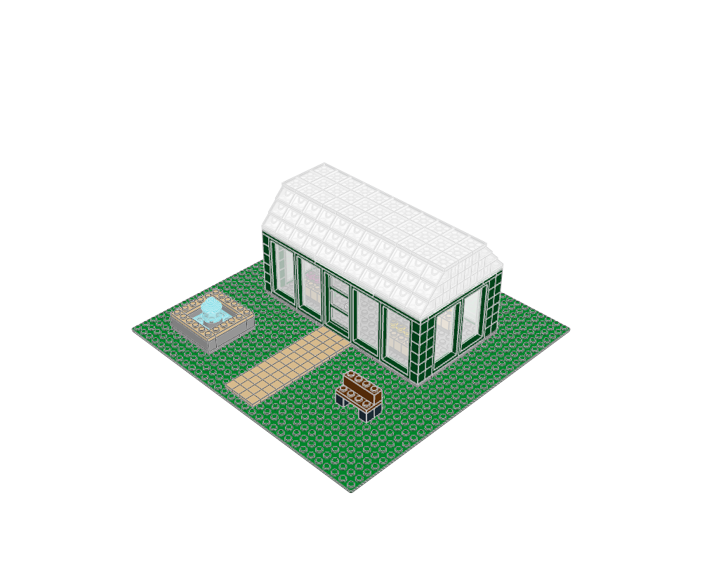

# Fernlight Glasshouse

Gardens and recreational buildings · minifigure scale · 437 physical placements · 9 FILE sections.



[MPD](conservatory.mpd) · [Editable plan](scene.plan.json) · [Front](front.png) · [Top](top.png) · [Validation](validation.json) · [BOM comparison](bom-comparison.json) · [Review](visual-review.json)

## What to learn

A transparent envelope and repeated dark mullions let planting become the interior focus.

**Place details:** Keep dense plants inside the glazed volume and quiet paths outside.

**Avoid:** Do not fill the roof with opaque decoration or block every view through the glazing.

This is an original teaching model. The [LEGO example](https://www.lego.com/en-us/product/the-botanical-garden-21353) establishes the building family; its source geometry was not copied. The family labels are the atlas's practical classification, not an exhaustive official LEGO taxonomy.

## Construction

The root section places the site and named modules. `base` anchors describe underside contact planes; `roof` anchors use body-top heights. The [shared helpers](../../../ldraw_tools/architecture.py) author X/Z in studs and upward height in LDU, then emit `[20*x, -h, 20*z]`. The [generator](../generate.py) contains the composition and every reserved footprint. Inspect unfamiliar parts with `ldraw-agent part` before changing their interfaces.

| Submodel | Construction purpose |
|---|---|
| `glasshouse-shell.ldr` | Repeated glazing within an open structural frame; front entry remains clear |
| `display4-288.ldr` | Four-stud full-height fixed glazing; bottom Y=0, height 144 LDU |
| `door4-288-288-glazed.ldr` | Four-stud closed hinged entrance; bottom Y=0, height 144 LDU; front -Z |
| `glass-roof.ldr` | Removable gabled roof: supported slope courses, contrasting gable core and tiled ridge |
| `flower-box-5.ldr` | Four by two stud planter with flowers; bottom Y=0 |
| `flower-box-14.ldr` | Four by two stud planter with flowers; bottom Y=0 |
| `bench-70.ldr` | Four-stud garden/platform bench; bottom Y=0; front -Z |
| `garden-fountain.ldr` | Six-stud pool and central water column; base Y=0, front -Z |

Render and inspect one submodel with `--section NAME --colour CODE`; replace NAME with a FILE name from this table. The [detail library](../details/README.md) supplies isolated modules with measured envelopes, local anchors and placement advice. Use the [placement guide](../../../docs/agent/building-atlas.md) when composing a different scene.

```sh
.venv/bin/python examples/building-atlas/generate.py conservatory --outdir output/atlas-study --render
./ldraw-agent build examples/building-atlas/conservatory/scene.plan.json --output output/conservatory.mpd --detail summary
```

Change the generator for reproducible structural edits; changing only the emitted MPD loses the change on regeneration. The examples focus on exterior composition and interfaces. Most rooms have no furniture or internal stairs; the skyline is explicitly microscale. No vehicles, minifigures, moving mechanisms or manufacturing inventory are implied. Read the per-view observations and physical scope in the [collection review](../visual-review.md).
