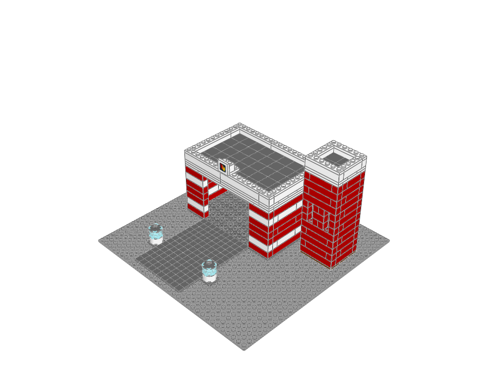

# Cinder Bay Fire Station

Emergency services · minifigure scale · 462 physical placements · 7 FILE sections.



[MPD](fire-station.mpd) · [Editable plan](scene.plan.json) · [Front](front.png) · [Top](top.png) · [Validation](validation.json) · [BOM comparison](bom-comparison.json) · [Review](visual-review.json)

## What to learn

A wide vehicle portal, hose tower and red/white bands make the function readable.

**Place details:** The vehicle apron stays empty; the tower sits behind one edge of the garage.

**Avoid:** Do not put trees, benches or stairs in the vehicle exit.

This is an original teaching model. The [LEGO example](https://www.lego.com/en-us/product/fire-station-60320) establishes the building family; its source geometry was not copied. The family labels are the atlas's practical classification, not an exhaustive official LEGO taxonomy.

## Construction

The root section places the site and named modules. `base` anchors describe underside contact planes; `roof` anchors use body-top heights. The [shared helpers](../../../ldraw_tools/architecture.py) author X/Z in studs and upward height in LDU, then emit `[20*x, -h, 20*z]`. The [generator](../generate.py) contains the composition and every reserved footprint. Inspect unfamiliar parts with `ldraw-agent part` before changing their interfaces.

| Submodel | Construction purpose |
|---|---|
| `fire-garage.ldr` | Wide clear vehicle opening, bonded red/white walls and supported lintel |
| `fire-garage-roof.ldr` | Flat lift-off roof with a low parapet and recessed quiet roof surface |
| `fire-emblem.ldr` | Upright two-stud emblem on a side-stud mount; base Y=0, face -Z |
| `hose-tower.ldr` | 6 by 6 stud shell with reserved door/window openings and removable roof interface |
| `hose-tower-cap.ldr` | Flat lift-off roof with a low parapet and recessed quiet roof surface |
| `landing-beacon.ldr` | Low blue landing beacon; functional industrial lighting |

Render and inspect one submodel with `--section NAME --colour CODE`; replace NAME with a FILE name from this table. The [detail library](../details/README.md) supplies isolated modules with measured envelopes, local anchors and placement advice. Use the [placement guide](../../../docs/agent/building-atlas.md) when composing a different scene.

```sh
.venv/bin/python examples/building-atlas/generate.py fire-station --outdir output/atlas-study --render
./ldraw-agent build examples/building-atlas/fire-station/scene.plan.json --output output/fire-station.mpd --detail summary
```

Change the generator for reproducible structural edits; changing only the emitted MPD loses the change on regeneration. The examples focus on exterior composition and interfaces. Most rooms have no furniture or internal stairs; the skyline is explicitly microscale. No vehicles, minifigures, moving mechanisms or manufacturing inventory are implied. Read the per-view observations and physical scope in the [collection review](../visual-review.md).
