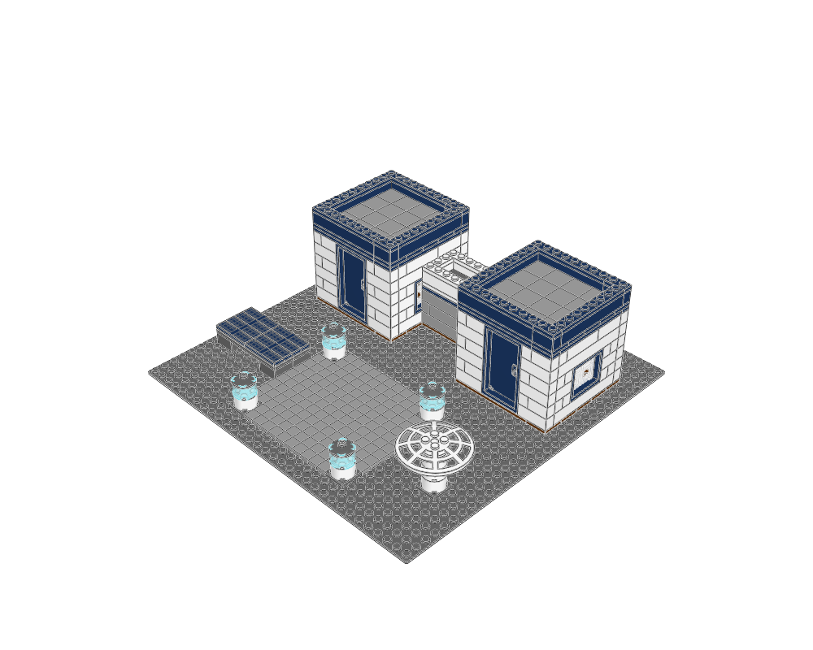

# Selene Research Outpost

Science fiction and space habitats · minifigure scale · 487 physical placements · 12 FILE sections.



[MPD](moon-base.mpd) · [Editable plan](scene.plan.json) · [Front](front.png) · [Top](top.png) · [Validation](validation.json) · [BOM comparison](bom-comparison.json) · [Review](visual-review.json)

## What to learn

Two low habitats, a linking passage and a separate landing pad form a coherent functional compound.

**Place details:** Use white hulls, dark equipment and localized blue glazing; beacons define the landing edge.

**Avoid:** Keep terrestrial landscaping and Victorian lamps out; the dish is static, not an articulated mechanism.

This is an original teaching model. The [LEGO example](https://www.lego.com/en-us/product/lunar-research-base-60350) establishes the building family; its source geometry was not copied. The family labels are the atlas's practical classification, not an exhaustive official LEGO taxonomy.

## Construction

The root section places the site and named modules. `base` anchors describe underside contact planes; `roof` anchors use body-top heights. The [shared helpers](../../../ldraw_tools/architecture.py) author X/Z in studs and upward height in LDU, then emit `[20*x, -h, 20*z]`. The [generator](../generate.py) contains the composition and every reserved footprint. Inspect unfamiliar parts with `ldraw-agent part` before changing their interfaces.

| Submodel | Construction purpose |
|---|---|
| `habitat--9.ldr` | 10 by 10 stud shell with reserved door/window openings and removable roof interface |
| `door4-272-70-hatch.ldr` | Four-stud closed hinged entrance; bottom Y=0, height 144 LDU; front -Z |
| `window4-272-47.ldr` | Four-stud glazed bay; bottom Y=0, body height 72 LDU, front -Z |
| `habitat--9-roof.ldr` | Flat lift-off roof with a low parapet and recessed quiet roof surface |
| `habitat-9.ldr` | 10 by 10 stud shell with reserved door/window openings and removable roof interface |
| `habitat-9-roof.ldr` | Flat lift-off roof with a low parapet and recessed quiet roof surface |
| `service-link.ldr` | 8 by 4 stud shell with reserved door/window openings and removable roof interface |
| `service-link-roof.ldr` | Flat lift-off roof with a low parapet and recessed quiet roof surface |
| `landing-beacon.ldr` | Low blue landing beacon; functional industrial lighting |
| `communications-dish.ldr` | Static upward-facing six-stud dish on a low mast |
| `solar-array.ldr` | Eight by four stud static solar rack; base Y=0; all panels rest on real supports |

Render and inspect one submodel with `--section NAME --colour CODE`; replace NAME with a FILE name from this table. The [detail library](../details/README.md) supplies isolated modules with measured envelopes, local anchors and placement advice. Use the [placement guide](../../../docs/agent/building-atlas.md) when composing a different scene.

```sh
.venv/bin/python examples/building-atlas/generate.py moon-base --outdir output/atlas-study --render
./ldraw-agent build examples/building-atlas/moon-base/scene.plan.json --output output/moon-base.mpd --detail summary
```

Change the generator for reproducible structural edits; changing only the emitted MPD loses the change on regeneration. The examples focus on exterior composition and interfaces. Most rooms have no furniture or internal stairs; the skyline is explicitly microscale. No vehicles, minifigures, moving mechanisms or manufacturing inventory are implied. Read the per-view observations and physical scope in the [collection review](../visual-review.md).
