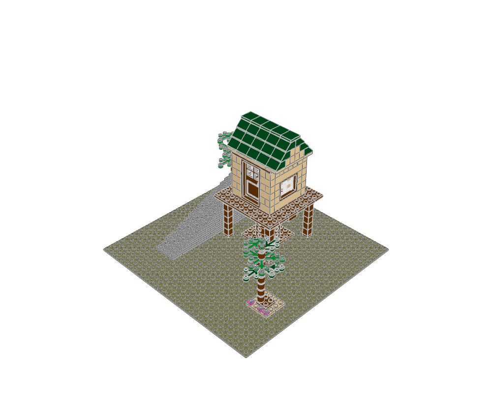

# Canopy Field Station

Treehouses and nature shelters · minifigure scale · 339 physical placements · 9 FILE sections.



[MPD](treehouse.mpd) · [Editable plan](scene.plan.json) · [Front](front.png) · [Top](top.png) · [Validation](validation.json) · [BOM comparison](bom-comparison.json) · [Review](visual-review.json)

## What to learn

An elevated hut, visible support trunk, access stair and surrounding canopy form a vertical nature scene.

**Place details:** Let the trunk remain visible below the platform; foliage frames the hut instead of intersecting it.

**Avoid:** Never float a hut in leaves; the platform needs a continuous load path and access.

This is an original teaching model. The [LEGO example](https://www.lego.com/en-us/product/tree-house-21318) establishes the building family; its source geometry was not copied. The family labels are the atlas's practical classification, not an exhaustive official LEGO taxonomy.

## Construction

The root section places the site and named modules. `base` anchors describe underside contact planes; `roof` anchors use body-top heights. The [shared helpers](../../../ldraw_tools/architecture.py) author X/Z in studs and upward height in LDU, then emit `[20*x, -h, 20*z]`. The [generator](../generate.py) contains the composition and every reserved footprint. Inspect unfamiliar parts with `ldraw-agent part` before changing their interfaces.

| Submodel | Construction purpose |
|---|---|
| `tree-platform.ldr` | Raised 12x12 deck carried by a central trunk and four timber posts |
| `canopy-hut.ldr` | 8 by 8 stud shell with reserved door/window openings and removable roof interface |
| `door4-70-70-traditional.ldr` | Four-stud closed hinged entrance; bottom Y=0, height 144 LDU; front -Z |
| `window4-70-47.ldr` | Four-stud glazed bay; bottom Y=0, body height 72 LDU, front -Z |
| `canopy-roof.ldr` | Removable gabled roof: supported slope courses, contrasting gable core and tiled ridge |
| `stairs-4-20.ldr` | Supported steps, 8 LDU rise and one-stud tread; front -Z |
| `leaf-tree-288-5.ldr` | Layered garden tree; bottom Y=0; foliage needs a nine-stud clearing |
| `leaf-tree-2-14.ldr` | Layered garden tree; bottom Y=0; foliage needs a nine-stud clearing |

Render and inspect one submodel with `--section NAME --colour CODE`; replace NAME with a FILE name from this table. The [detail library](../details/README.md) supplies isolated modules with measured envelopes, local anchors and placement advice. Use the [placement guide](../../../docs/agent/building-atlas.md) when composing a different scene.

```sh
.venv/bin/python examples/building-atlas/generate.py treehouse --outdir output/atlas-study --render
./ldraw-agent build examples/building-atlas/treehouse/scene.plan.json --output output/treehouse.mpd --detail summary
```

Change the generator for reproducible structural edits; changing only the emitted MPD loses the change on regeneration. The examples focus on exterior composition and interfaces. Most rooms have no furniture or internal stairs; the skyline is explicitly microscale. No vehicles, minifigures, moving mechanisms or manufacturing inventory are implied. Read the per-view observations and physical scope in the [collection review](../visual-review.md).
