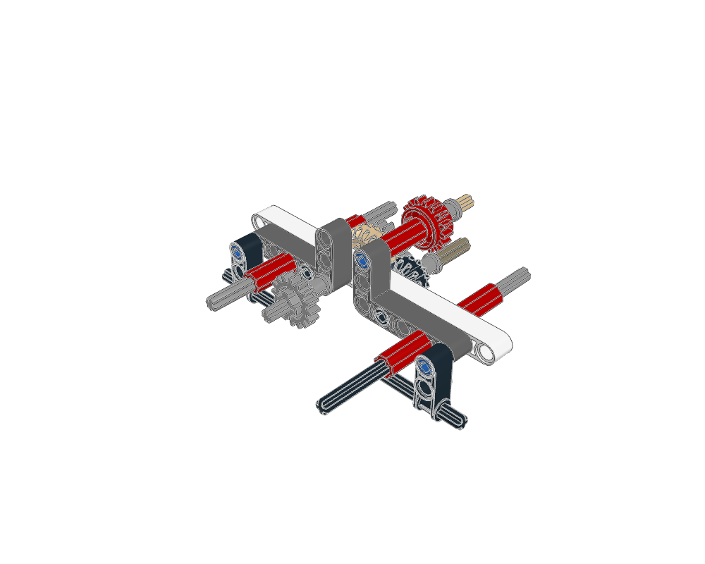
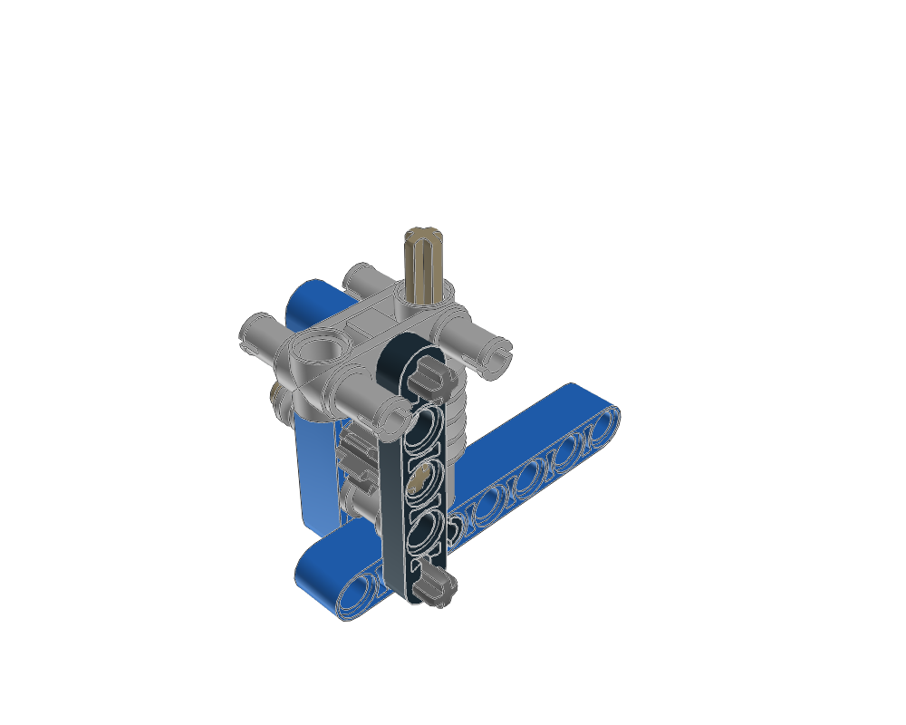
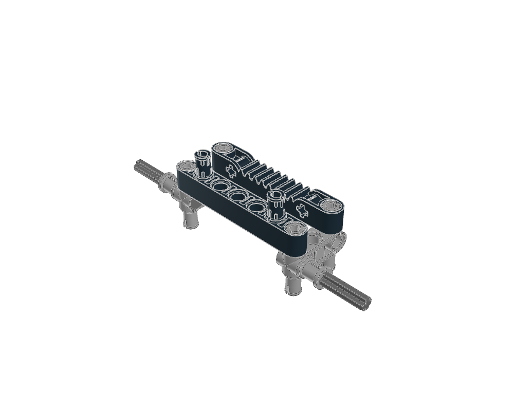
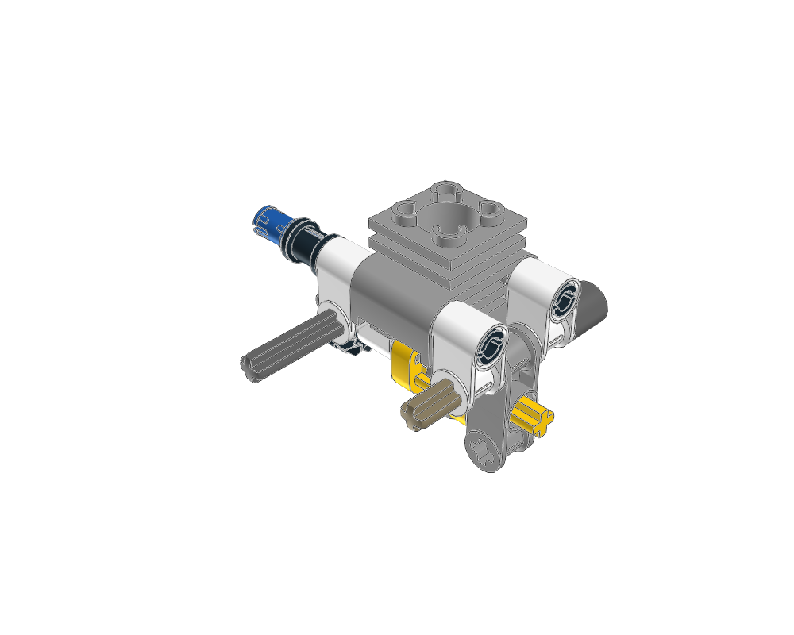
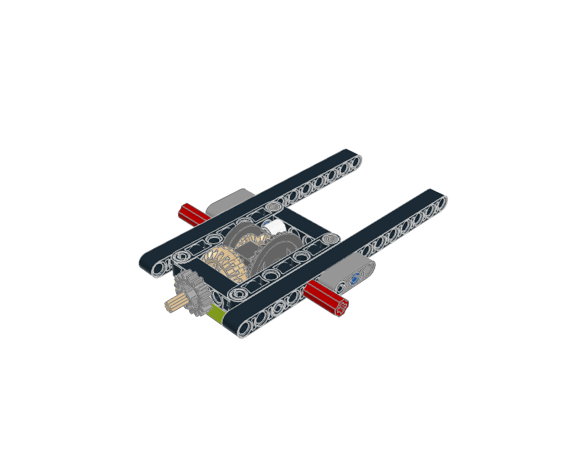
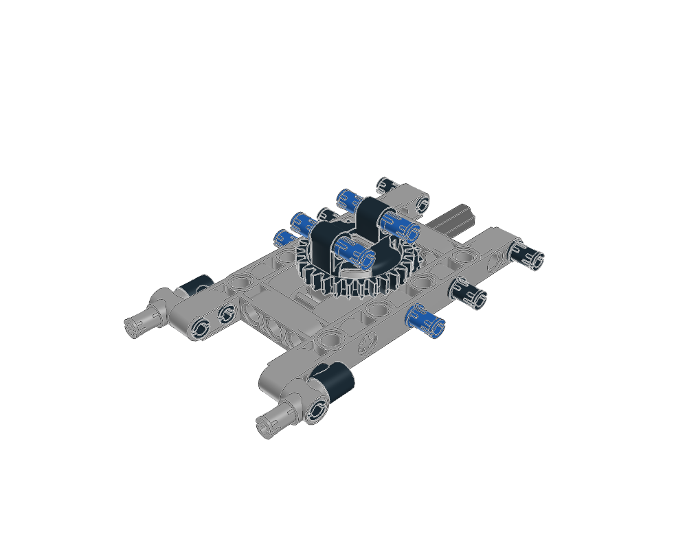

# Build with mechanisms

Six small Technic constructions to study, copy and adapt. Each includes the original attributed parts, step-by-step images, parts lists, operation notes and an editable placement plan.

For a wider design vocabulary, see [Mecha construction studies](../technic-studies/README.md) and the [Technic design guide](../../docs/agent/technic-design.md): suspension, multi-crank engines, selectors, Cardan shafts and lifts, with source qualifications and new subject ideas. Those notes complement these six exportable manuals.

The [Technic atlas](../technic-atlas/README.md#mechanisms-from-ldraw-mecha) now adds six portable mechanism studies with their own build pages: a four-cylinder bank, cam followers, a paired Cardan shaft, four-speed gearbox, four-bar lift and independent suspension. Find them with `examples --family technic`; export their prepared directories using `mechanism export`.

Open the [interactive gallery](index.html) locally, choose a construction and move through its steps. Yellow outlines show the additions. Switch viewpoints to see the shaft stacks, gear faces and supports.

| Construction | Preview | Parts | Steps | What to learn |
| --- | --- | ---: | ---: | --- |
| [Gear and axle module](gear-reduction/GUIDE.md) | [](gear-reduction/index.html) | 35 | 5 | Gear layers, axle joiners and gearbox interfaces |
| [Worm-drive support](worm-drive/GUIDE.md) | [](worm-drive/index.html) | 14 | 3 | Worm shaft, driven gear and retaining supports |
| [Steering rack carriage](steering-rack/GUIDE.md) | [](steering-rack/index.html) | 10 | 3 | Rack placement and connections supplied by the parent |
| [Piston and crank](piston-crank/GUIDE.md) | [](piston-crank/index.html) | 19 | 4 | Dedicated engine parts and embedded cylinder geometry |
| [Differential](differential/GUIDE.md) | [](differential/index.html) | 29 | 4 | Internal bevel gears, axle outputs and supporting frame |
| [Driven turntable](driven-turntable/GUIDE.md) | [](driven-turntable/index.html) | 25 | 3 | Matching turntable halves, drive gear and upper mounts |

These studies cover **132 placements and 22 construction steps**. All 49 step images and six final previews were opened; source checks pass and all six Python/LeoCAD BOM comparisons match. See the [visual review](visual-review.md).

## Use one in a model

```sh
./ldraw-agent mechanism list
./ldraw-agent mechanism export worm-drive --outdir output/my-winch
./ldraw-agent build output/my-winch/scene.plan.json --contacts none \
  --output output/my-winch/my-winch.mpd
```

Read the exported guide and manual. Edit `scene.plan.json` to position the whole assembly; edit `source.mpd` to adapt its internal construction. The included `generate.py` rebuilds the placement from those local files. Keep the attribution and extraction manifest, adapt the external mounts, then render and review the combined model. The `source_origin` anchor is a positioning frame, not a promised physical connector.

These are useful sections of larger models. For example, the steering rack needs its parent's driving pinion, and the worm drive needs the winding assembly. `operation.json` records the fixed structure, intended moving elements, input, output and parent dependencies. Source STEP groups can also add concealed internal parts together with their enclosure; use the per-step list and MPD for those details.

Analytical mechanism verification is deferred at the user's request. The workflow checks source, geometry, parts and images; it describes intended operation without claiming motion simulation or physical certification. Fixed supports can still use the [structural workflow](../../docs/agent/technic.md).

## Study another mechanism

Follow the [agent mechanism workflow](../../docs/agent/mechanisms.md). Search with `discover search submodels ... --construction mechanism`, checking Jev availability first and using `--engine fts` when unavailable. `mechanism prepare` creates the source and build pages; `mechanism review` records pages actually inspected; `mechanism export` copies a current reviewed study.

[selections.json](selections.json) records the six exact Jev results, source identities, source hashes and study notes. Their source headers retain the original authors and licences.

To recreate this atlas from the annotated source library:

```sh
.venv/bin/python examples/mechanism-atlas/generate.py
# Or refresh just one study:
.venv/bin/python examples/mechanism-atlas/generate.py --name piston-crank
```

Regeneration checks the original source hashes, refreshes evidence and **clears visual reviews**. Open the new pages before recording new reviews. `--no-render` prepares source and data while leaving image review and the rendered BOM comparison pending. Exported individual generators need the toolkit and parts library, but do not need the annotated model originals.
