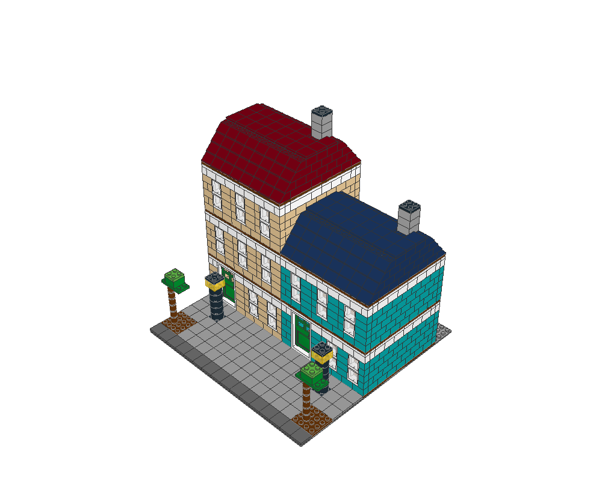
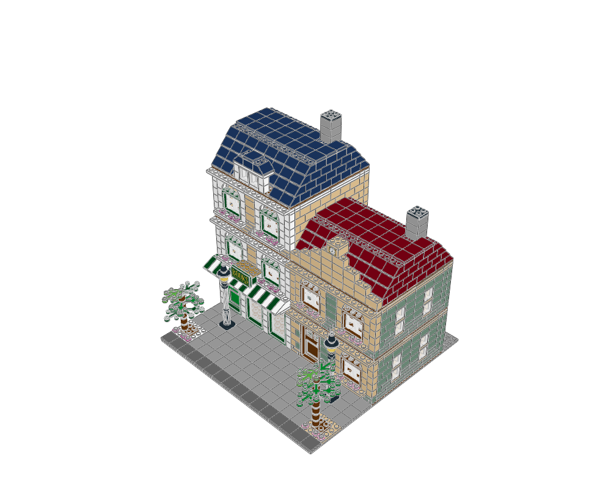
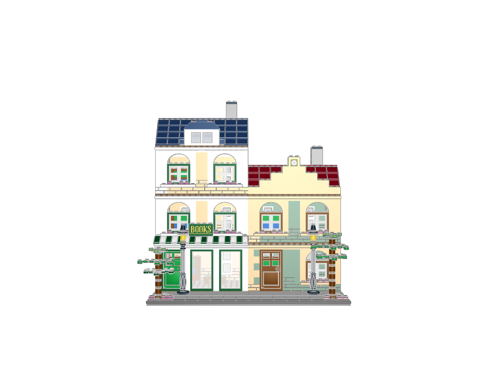
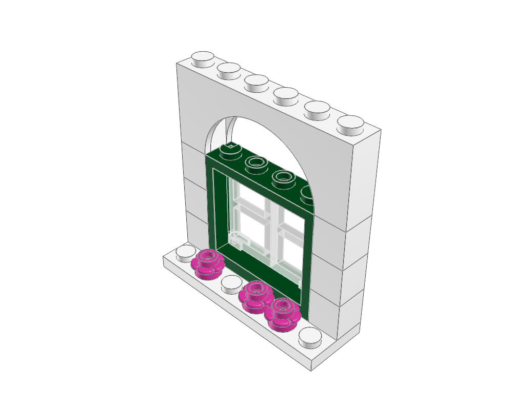

# Copper Lane visual review

Reviewed on 2026-09-07. The [brief](design-brief.json) asks for a botanical bookshop beside a quieter house, with different roof silhouettes and a clear shop entrance. Geometry passing was the starting condition; the revisions below address appearance and specific attachment problems found while detailing.

## Before and after

| Previous example | Revised example |
|---|---|
|  |  |

The previous façades had small repetitive windows, similar roof profiles and blocky trees. The revised façades have different identities: tan/white stonework and green shop fittings on the left, sand-green walls and warm trim on the right. The awnings and gold lettering make the bookshop the main feature. The dormer and stepped clock pediment distinguish the roofs. Repeated arch proportions and pink flower accents connect the buildings visually.

## Decisions made from actual views

| Observed weakness | Revision |
|---|---|
| Front walls read as repeated brick grids with small openings. | Reserve six-stud window bays, use real arch/frame/pane parts, project the sills and cornice, and confine embossed masonry mostly to lower courses. |
| The roofs had little individual character. | Cut a dormer opening into the bookshop's slope layout; give the house a stepped clock pediment and a different roof colour. |
| The shop did not read clearly from the street. | Add tall display glazing, green-and-white awnings and a sign above them. |
| The first sign's two white page tiles looked like a blank plaque. | Search the categories for patterned book tiles, open a LeoCAD shortlist, and use the actual metallic-gold BOOKS tile on the side-stud mounts. |
| One-piece tree candidates looked mechanically ribbed in the first redesign render. | Build four foliage layers on round trunks, vary leaf orientation and tree height, and use small flowers at the base. |
| Exposed side walls still looked blank in the home view. | Reserve openings for two vertical window pairs per storey on each exposed side. Keep the party walls solid. |
| The first awning beam did not meet the slopes' actual underside sockets. | Replace it with a two-row beam; its front row mates the sockets at local Z=-20 and its rear row attaches to the cornice. The isolated nine-part recipe now reports eight contacts in one group. |

The opened views include whole-scene home/front/top, back/left elevations, ground-floor home/top, a close arched-window view and real part shortlist images. After the last sign change, whole-scene home/front/top and ground-floor home/top were regenerated and opened again. The retained images show the final geometry for their respective views; the unchanged window detail uses the same recipe. Working images and reports live under ignored `output/`.

## Assessment and limits

The entrance and lettering are readable from the front, while the home view shows the projecting façade layers and distinct roof features. Large roof planes and the pavement remain relatively quiet. Side glazing carries the architectural rhythm around the exposed walls. Flowers and foliage add colour in localized areas; the taller tree partly screens a ground-floor window, and the left canopy projects past the pavement edge.

The interiors remain simple reading rooms with shelves and tables; the rear is deliberately plainer. Floors lift off, with no stairwell or minifigures in this example. The open area above each rectangular front frame is an architectural arch opening, not a fitted fanlight. These are explicit scope choices rather than evidence that every feature of a real building is represented.

The final [validation](validation.json) resolves 1,655 placements without errors, and the [Python/LeoCAD BOM comparison](bom-comparison.json) matches exactly. Automatic whole-scene contacts are skipped at this size; general collision coverage is incomplete. Local checks are evidence of intended mating geometry, not material-intersection, strength, stability or retail colour availability certification. See the [verification record](../../docs/agent/verification.md).

To apply the technique to another model, use the [design guide](../../docs/agent/visual-design.md), choose its own focal feature and detail vocabulary, and perform a fresh review of its rendered images.
