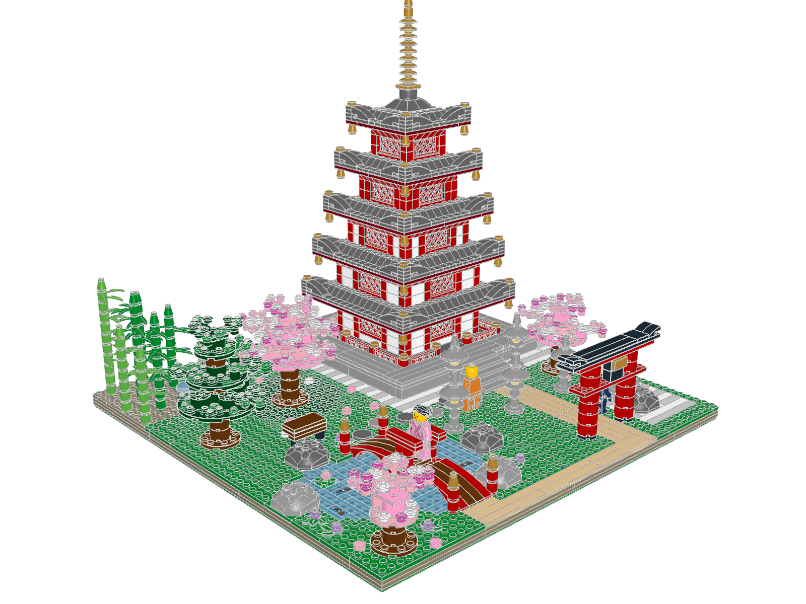

# Sakura Garden

A Japanese temple garden in cherry-blossom season, built on one 48×48 stud
baseplate. A vermilion five-storey pagoda with flared, gilded eaves stands on
a stone platform. You enter through a torii on a flagstone axis, cross a koi
pond on a humped bridge, and pass stone lanterns, a bamboo grove, a
cloud-pruned pine, a raked dry garden and three flowering cherries. A visitor
in a pink robe stands on the bridge, a monk walks the stepping stones, and a
gardener in a rice hat waits by the gravel.



**2,175 physical placements** (88 distinct parts, 244 part/colour rows) in
33 FILE blocks. The footprint is 960×960 LDU, and the model stands 944 LDU
tall.

## Files

| What | Where |
|---|---|
| Final model | [sakura-garden.mpd](sakura-garden.mpd) |
| Generator (edit this) | [generate.py](generate.py) → [sakura-garden.plan.json](sakura-garden.plan.json) |
| Hero renders | [render_hero.py](render_hero.py) → [hero/](hero/) |
| Design brief | [design-brief.md](design-brief.md) |
| Visual review | [visual-review.md](visual-review.md) |
| Terrain map (top = back, bottom = front) | [terrain-map.txt](terrain-map.txt) |
| Validation | [sakura-garden.validation.json](sakura-garden.validation.json) |
| Full-contact inspection | [sakura-garden.inspection.json](sakura-garden.inspection.json), [connectivity.txt](connectivity.txt) |
| Overlap triage | [overlap-triage.txt](overlap-triage.txt) (from [overlaps-full.json](overlaps-full.json)) |
| BOM / LeoCAD comparison | [sakura-garden.bom.json](sakura-garden.bom.json), [sakura-garden.bom-comparison.json](sakura-garden.bom-comparison.json) |
| LeoCAD import check | [sakura-garden.check-model.json](sakura-garden.check-model.json) |
| Review renders | [review/](review/) — home, front, back, left, right, top |
| Module renders and inspections | [modules/](modules/) |
| Research (Jev queries, part boards, 10315 study) | [research/](research/) |
| Earlier passes and prototypes | [iterations/](iterations/), [proto/](proto/) |
| Review helpers | [tools/](tools/) |

## Rebuild

Run from the repository root:

```sh
.venv/bin/python output/sakura-garden/generate.py --map
./ldraw-agent build output/sakura-garden/sakura-garden.plan.json \
  --output output/sakura-garden/sakura-garden.mpd --detail summary --force \
  --report output/sakura-garden/sakura-garden.build.json
./ldraw-agent validate output/sakura-garden/sakura-garden.mpd --geometry --detail summary \
  --report output/sakura-garden/sakura-garden.validation.json
./ldraw-agent inspect output/sakura-garden/sakura-garden.mpd --contacts all --detail summary \
  --report output/sakura-garden/sakura-garden.inspection.json
./ldraw-agent bom output/sakura-garden/sakura-garden.mpd --report output/sakura-garden/sakura-garden.bom.json
./check-model.sh output/sakura-garden/sakura-garden.mpd
./ldraw-agent render output/sakura-garden/sakura-garden.mpd --outdir output/sakura-garden/review \
  --views home front back left right top
./ldraw-agent compare-bom output/sakura-garden/sakura-garden.mpd \
  --csv output/sakura-garden/review/leocad-bom.csv \
  --report output/sakura-garden/sakura-garden.bom-comparison.json
.venv/bin/python output/sakura-garden/render_hero.py
```

For the overlap and connectivity summaries, run `inspect --detail full --limit 6000`
(with `--contacts none` and `--contacts all` respectively), then
`tools/overlap_triage.py` and `tools/components.py` on the reports. The
generator is deterministic: two runs produce byte-identical plans.

## Checks on this exact revision

| Check | Result |
|---|---|
| `build` (assembly profile + geometry) | passed, no errors |
| `validate --geometry` | passed. Warnings: contacts skipped in auto mode (so full contacts were run separately) and non-curated parts need collision review |
| `inspect --contacts all` | 10,452 contacts; one component of 2,136 parts plus 32 small groups, all explained below |
| Overlap candidates | 2,797. Every pair deeper than stud engagement (29 part-pair groups) was reviewed; none is a material intersection (see below) |
| BOM vs LeoCAD | exact match, 2,175 = 2,175 |
| `check-model.sh` (LeoCAD import/snapshot/BOM) | passed |
| Images | review views and hero shots opened and reviewed ([visual-review.md](visual-review.md)) |

`physical_validity` stays `not_proven`, as intended.

### The 32 small connector groups

These are standard connections the connector solver can't pair, not floating
parts:

- 1×1 cones `4589` (bells, giboshi, jewels, bamboo tips, spire finial): the
  underside is typed as axle holes.
- The 3×3 dish lantern roofs `43898`: the centre socket is modelled as
  frictionless, although it sits exactly on the fire-box stud (y = −88 for
  both).
- Minifigure arms `43368/43369`: no connector metadata.
- Hair and hat: they follow the LDraw head-origin convention.

The real floaters that the checks found (the pagoda lattice screens) and the
wrongly seated figures (the 1.2 LDU foot-socket offset) were fixed.

### Deep overlap candidates reviewed

- **Rock shell over its hidden round brick:** surface sampling shows no rock
  surface inside the brick's volume.
- **Lantern dish over its fire box:** no dish surface inside the fire-box
  cylinder.
- **Bridge arch slopes against the tip plates, crown plate and crown posts:**
  bounding boxes only. The measured crest profile leaves the inner crown studs
  clear.
- **Two bamboo leaf fans at one level:** 15.8 LDU apart at their closest
  surfaces.
- **Minifigure internals, hat over head, plaque tile on side studs:**
  intended engagement.
- **Cherry disc against a lantern roof:** separated circles, 113 LDU apart
  between centres against a 90 LDU sum of radii.

## Physical limits not proven

- Clutch strength and stability were not measured. The pagoda's eave decks
  cantilever 2–3 studs over red corbels. Each wall course is bonded, but the
  1×1 corner posts are clamped columns.
- The bridge's central legs and the boulder rims rest on flat surfaces without
  clutch. They are held through their tips, sockets and hidden bricks.
- Several fronds and petals sit at 45° rotations on single studs. That is a
  valid rigid pose, but it isn't a grid-aligned build.
- I didn't do a detailed material-intersection pass. The containment and
  clearance cases above were checked by sampling LDraw surfaces instead.
- Availability of every part in every listed colour is not claimed.

## Attribution

This is an original design generated by the `ldraw-nova sakura-garden
generator`. Technique references came from LEGO set 10315 *Tranquil Garden*
(OMR source by Orion Pobursky, CC BY 4.0), which was studied but not copied.
The minifigure stack measurements are reused from this repository's
`examples/copper-bean` generator.
