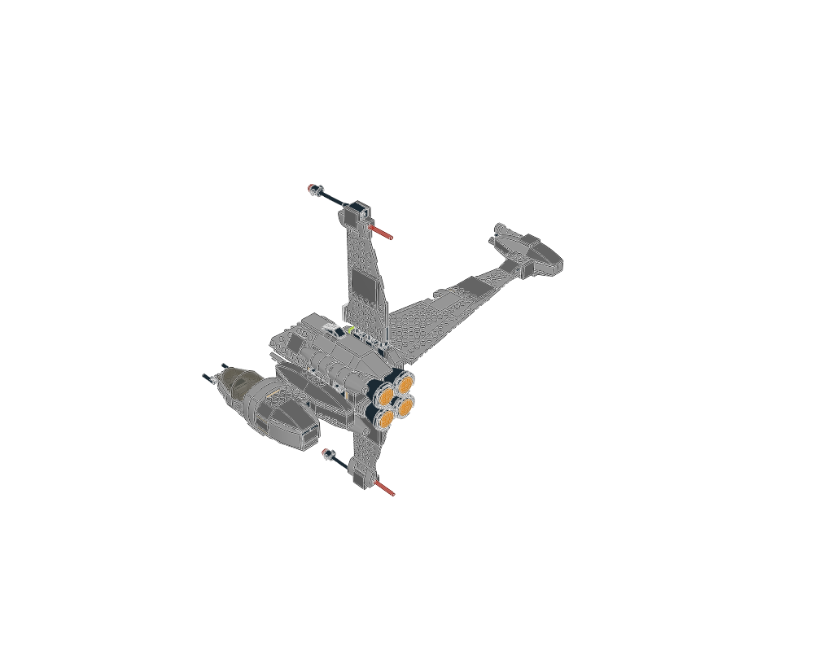
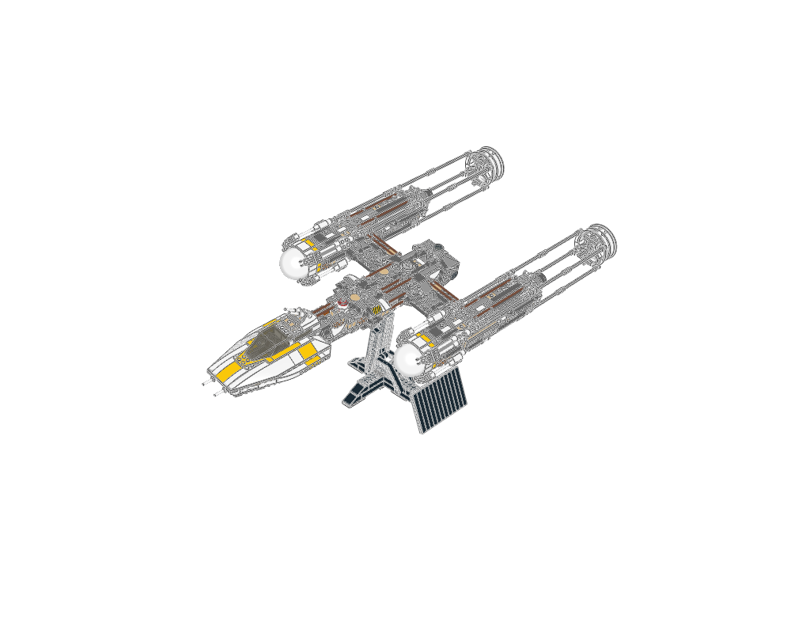
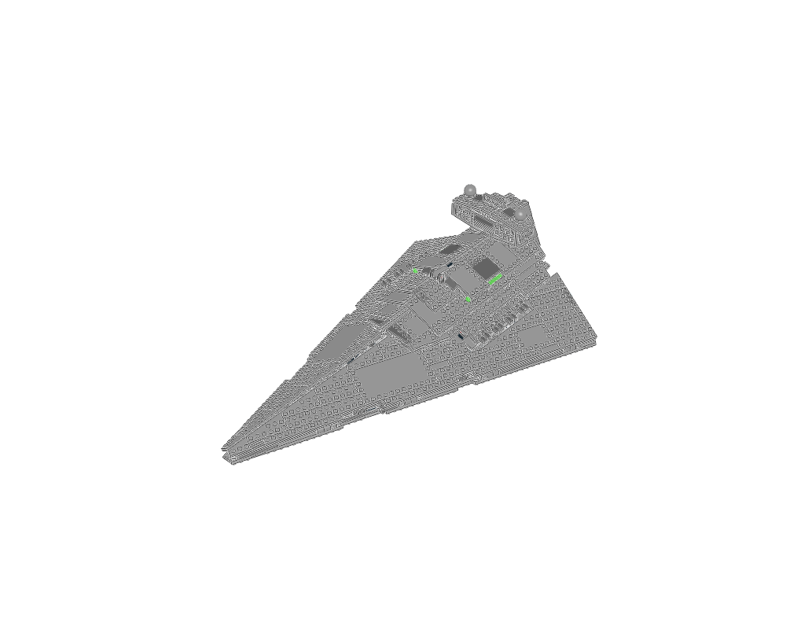

# Spaceships: shape, structure and detail

Study whole ships for their proportions. Study smaller assemblies to learn how to build their cockpits, wings, engines and surface details. The [interactive gallery](index.html) links the images, editable sources and construction notes.

| Whole-ship study | Preview | Parts | Use |
| --- | --- | ---: | --- |
| [B-wing starfighter](b-wing/GUIDE.md) | [](b-wing/index.html) | 434 | Checked, editable source construction |
| [UCS Y-wing](ucs-y-wing-study/GUIDE.md) | [](ucs-y-wing-study/index.html) | 1,493 | Inspiration: twin engines, exposed machinery and narrow spine |
| [Imperial Star Destroyer](star-destroyer-study/GUIDE.md) | [](star-destroyer-study/index.html) | 1,335 | Inspiration: wedge hull, recessed edges and layered superstructure |

The Y-wing and Star Destroyer retain source errors and **cannot be exported as checked constructions**. Their guides explain how to study their useful forms. The B-wing passes source and geometry checks after three precisely recorded corrections to rounded positions in a copied wing stack; its original library file is unchanged.

## Reusable constructions

| Construction | Parts | Study format | What to learn |
| --- | ---: | --- | --- |
| [UCS X-wing lower port wing](x-wing-wing/GUIDE.md) | 125 | Four completed views and source section data | Thin plate layers, a mounted nacelle and long tip detail |
| [UCS X-wing nacelle](x-wing-nacelle/GUIDE.md) | 41 | One source group, two views | Concentric cylinders, a long core and transverse mounts |
| [Enclosed canopy cockpit](canopy-cockpit/GUIDE.md) | 49 | Root and three child sections, two views each | Real octagonal canopy halves, hinge interfaces, rear glazing and pilot |
| [UCS Y-wing armour panel](y-wing-armour/GUIDE.md) | 31 | Seven steps, two views each | Layered support, clean sloping edges, vents and a central detail strip |
| [Millennium Falcon service cluster](falcon-greebles/GUIDE.md) | 15 | Three steps, two views each | Small moulded fittings arranged as a contained machinery bay |

All five constructions pass source/geometry checks and match their rendered BOMs. The cockpit retains legacy part aliases and its pilot; inspect those before substituting newer parts. A source with a single STEP group supplies one construction state, not an invented sequence of insertions.

All **50 images were opened**: 30 step views and 20 final/overview views. All eight Python/LeoCAD BOM comparisons match. The [visual review](visual-review.md) records what was inspected and learned.

## Start a spacecraft

```sh
./ldraw-agent spaceship list
./ldraw-agent spaceship details
./ldraw-agent spaceship brief starfighter --output output/my-ship-brief.json
./ldraw-agent spaceship export b-wing --outdir output/my-ship
./ldraw-agent build output/my-ship/scene.plan.json --contacts none \
  --output output/my-ship/my-ship.mpd
```

`brief` accepts `starfighter`, `freighter` or `capital-ship`. It helps an agent choose a silhouette, palette, modules, defining parts and review views. It is a starting brief; the agent still designs the model and its interfaces.

Export preserves the attributed source, provenance, editable placement plan, images and review. Change the whole-module placement in `scene.plan.json`, or adapt internal parts in `source.mpd`. The copied `generate.py` rebuilds those local files with the toolkit and parts library. It needs no original annotated model. A local origin is a positioning frame, not an asserted connector.

Follow the [spaceship workflow](../../docs/agent/spaceships.md) for hull design, Technic supports, actual mechanism modules and final visual review. Analytical mechanism verification remains deferred.

## Add more examples

Follow the [build-manual and atlas workflow](../../docs/agent/build-manuals.md). It explains how to preserve exact source identities, turn source steps into pages, study parent interfaces, review the images and select useful new entries for any atlas.

[selections.json](selections.json) pins these eight sources and their discovery evidence. [generate.py](generate.py) recreates them:

```sh
.venv/bin/python examples/spaceship-atlas/generate.py
.venv/bin/python examples/spaceship-atlas/generate.py --name y-wing-armour
```

Regeneration checks source hashes and clears the affected visual reviews. Reopen the new images before recording review again. `--no-render` leaves rendered evidence pending. Original authors and licences are retained; these are attributed source studies and adaptations, not newly claimed original spacecraft designs.
