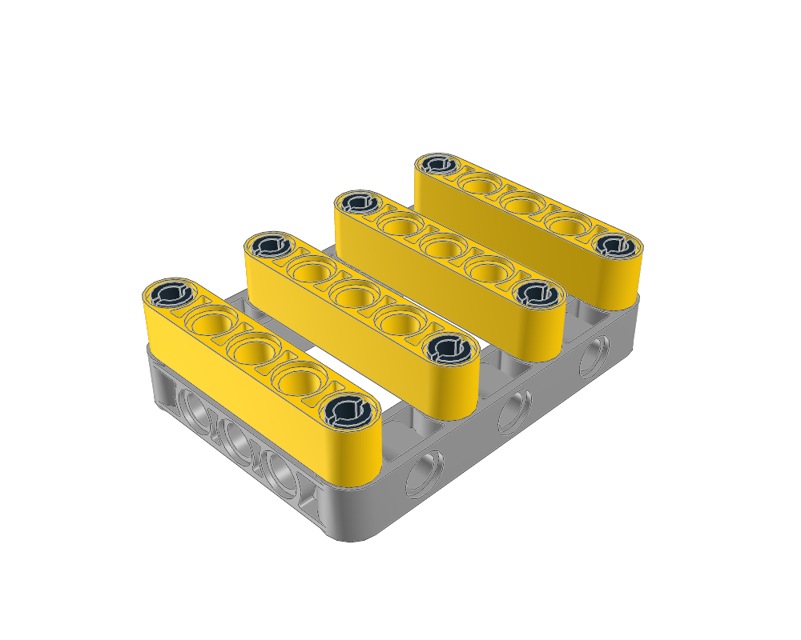
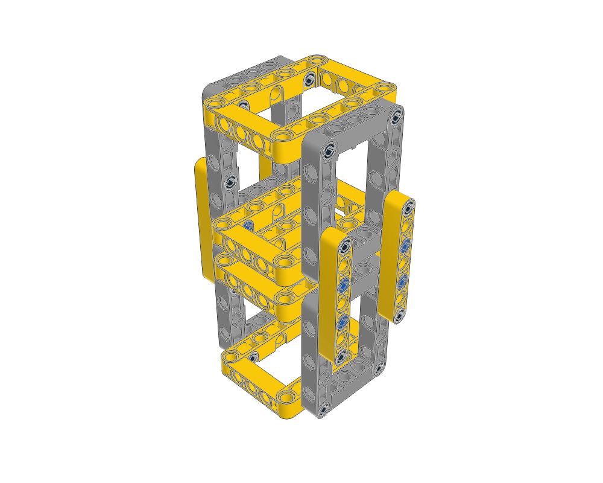
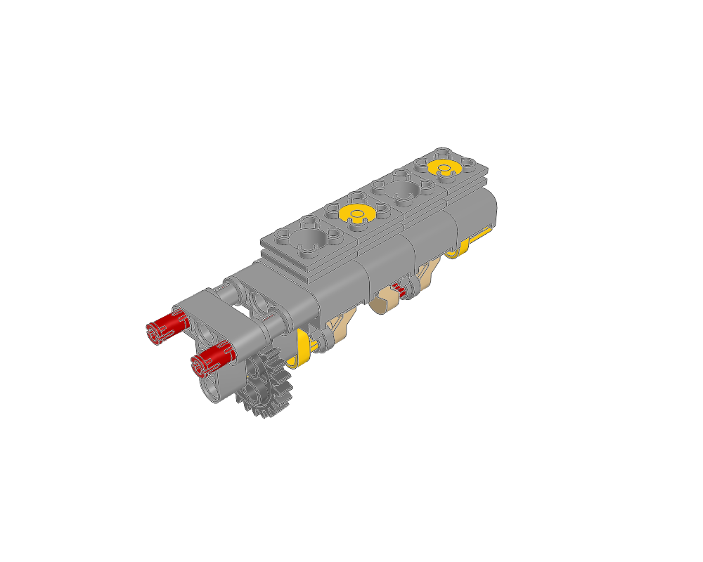
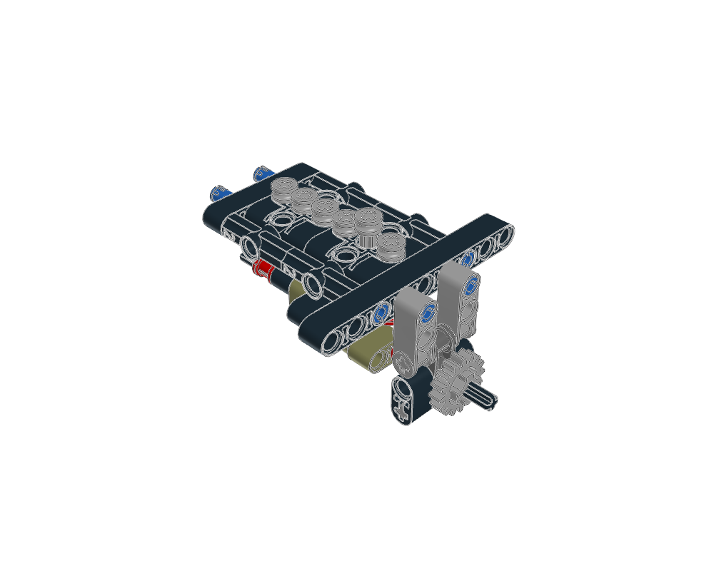
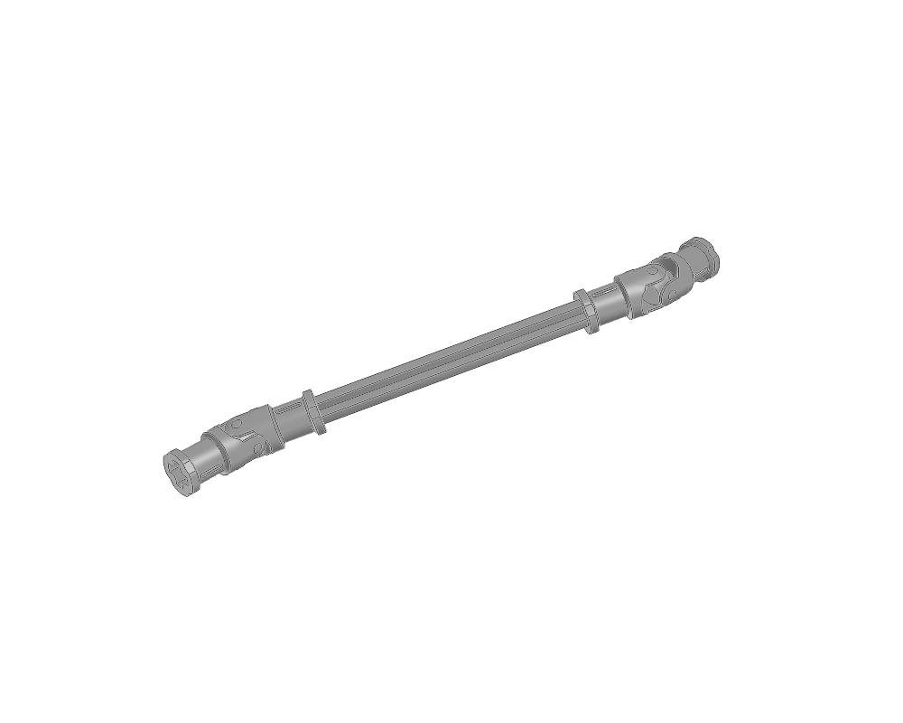
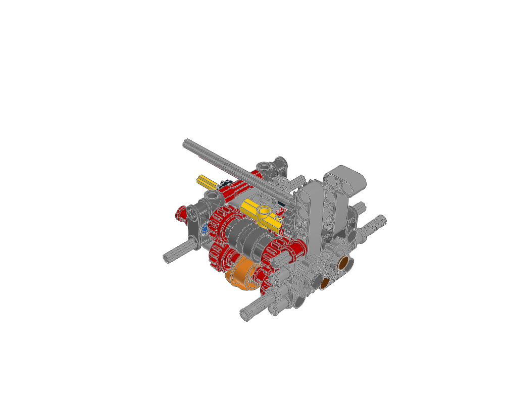
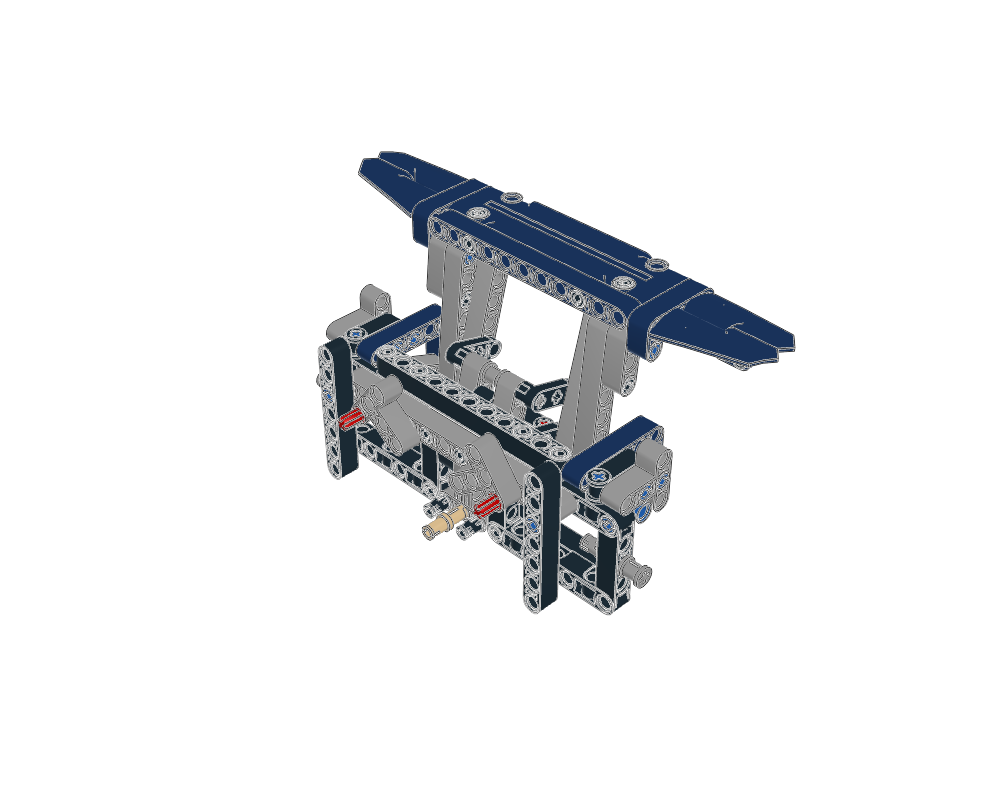
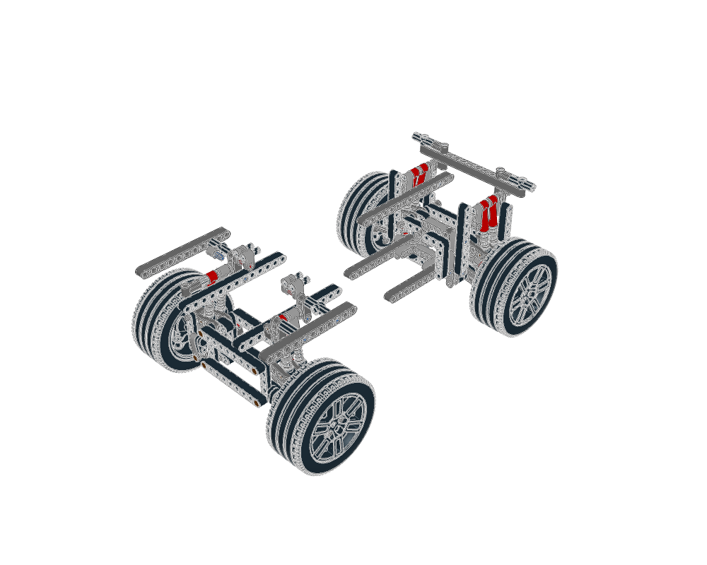

# Technic construction atlas

Four fixed structures and six mechanism studies teach complementary Technic techniques. Open the [interactive gallery](index.html), choose a construction and read its guide before adapting it. Mechanisms include editable source, a placement plan, source build pages, operation notes, provenance and rendered BOM evidence.

Use the [Technic design guide](../../docs/agent/technic-design.md) and [Mecha studies](../technic-studies/README.md) to turn these supports into more varied models with engines, transmissions, suspension or lifts. Keep fixed-frame contracts scoped to the structure.

## Fixed structures

These four constructions include a required-joint contract, geometry and structural checks, BOM comparison and seven views.

| Reinforced mounting frame | Box chassis |
| --- | --- |
| [](reinforced-frame/GUIDE.md) | [](box-chassis/GUIDE.md) |
| Two-point crossmembers on a moulded frame. | Perpendicular frames with long body rails. |

| Frame tower | Service platform |
| --- | --- |
| [](frame-tower/GUIDE.md) | [](service-platform/GUIDE.md) |
| Overlapping members join repeated box cells. | Eight stud-ended pins support a System deck and equipment body. |

Start with the [structural workflow](../../docs/agent/technic.md) and each model's `GUIDE.md`. [Structural visual review](visual-review.md) records what was inspected. These examples use conservative structural checks; physical strength and complete assembly access remain unproven.

## Mechanisms from ldraw-mecha

These additions fill gaps beyond the existing [six mechanism-atlas manuals](../mechanism-atlas/README.md), which cover a gear module, worm support, rack carriage, single piston, differential and turntable. Selection follows useful construction roles in the supplied Mecha examples; it does not import their animation runtime.

| Study | Preview | Parts | What it adds |
| --- | --- | ---: | --- |
| [Four-cylinder crank bank](mechanisms/four-cylinder-bank/GUIDE.md) | [](mechanisms/four-cylinder-bank/index.html) | 34 | Repeated rods and guided pistons, alternating phase, a geared input; add a supporting frame |
| [Cam-driven inline-six](mechanisms/cam-follower-engine/GUIDE.md) | [](mechanisms/cam-follower-engine/index.html) | 55 | Phased cams under a separate follower block; retain its raised rest follower and supply the upstream drive |
| [Paired Cardan shaft](mechanisms/double-cardan-shaft/GUIDE.md) | [](mechanisms/double-cardan-shaft/index.html) | 7 | Offset drive routing, two crosses and fork phasing; end bearings and adjoining shafts belong to the parent |
| [Four-speed gearbox](mechanisms/four-speed-gearbox/GUIDE.md) | [](mechanisms/four-speed-gearbox/index.html) | 66 | Constant-mesh paths, two driving rings and a rotary selector; add the external control and propshafts |
| [Four-bar lift](mechanisms/four-bar-lift/GUIDE.md) | [](mechanisms/four-bar-lift/index.html) | 119 | Level payload on paired cranks and closing rods; physically support the assumed fixed upper pivot |
| [Independent suspension](mechanisms/independent-suspension/GUIDE.md) | [](mechanisms/independent-suspension/index.html) | 259 | Wishbones, guide links, half-shafts and paired shocks; replace omitted boundary holders before reuse |

The studies contain **540 physical placements** in total. Each guide distinguishes retained construction, parent-supplied interfaces and intended operation. The Cardan, lift and suspension sources have one retained placement group, so their pages are multi-view assembly studies rather than recovered insertion sequences. The other studies retain source STEP groups and child-assembly pages.

The four-speed source contained two identical `4519.dat` axle placements at the same transform. The derived atlas input removes source index 43 and retains 39, reducing 67 parts to 66; [its provenance](mechanism-sources/four-speed-gearbox.provenance.json) records the exact repair. Supplied original models remain unchanged. The reconstructed Chiron eight-speed gearbox and incomplete paddle drive were not selected.

Read the [mechanism workflow](../../docs/agent/mechanisms.md) and [mechanism visual review](mechanism-visual-review.md). Analytical verification remains **deferred**; passing source checks, matching BOMs and inspected images do not certify operation or make an incomplete extract self-supporting.

## Find and reuse a study

```sh
./ldraw-agent examples --family technic --limit 20
./ldraw-agent examples --family technic suspension
./ldraw-agent mechanism export examples/technic-atlas/mechanisms/four-bar-lift \
  --outdir output/my-lift
./ldraw-agent build output/my-lift/scene.plan.json --contacts none \
  --output output/my-lift/my-lift.mpd
```

Use the directory form of `mechanism export` for these studies. `technic plan` still generates the four fixed structural recipes, and `mechanism list` lists the separate mechanism atlas. The exported source and generator work without the sibling checkout; read the retained `provenance/` records and keep attribution. Change the supporting frame, body and accessible controls around the studied core, then review the combined model.

## Regenerate

```sh
.venv/bin/python examples/technic-atlas/generate.py --renders
.venv/bin/python examples/technic-atlas/generate.py --name frame-tower --levels 3 --renders
# Rebuild mechanisms from their bundled, pinned source selections:
.venv/bin/python examples/technic-atlas/generate_mechanisms.py
.venv/bin/python examples/technic-atlas/generate_mechanisms.py --name four-bar-lift
# After opening all new images and recording mechanism review:
.venv/bin/python examples/technic-atlas/generate_mechanisms.py --refresh-catalog
```

The per-model `generate.py` rebuilds its source and checks. The shared generator's `--renders` option refreshes all seven views and compares the LeoCAD BOM. Reopen the images and update the review after changing a model. A view from an older source revision is not current evidence. Each `visual-review.json` binds the reviewed source and seven images by hash; regeneration drops the current-review catalog link if any of them change.

For mechanisms, `generate_mechanisms.py` uses [mechanism-selections.json](mechanism-selections.json) and attributed inputs under `mechanism-sources/`. It verifies source/provenance hashes, prepares pages, builds the editable placement and clears old visual reviews. `--no-render` leaves image and rendered-BOM review pending. Each exported mechanism's own `generate.py` rebuilds its placement only; page regeneration is a separate operation. Both shared generators retain the other family’s catalog entries.

Source knowledge: Carlos Antelo, **ldraw-mecha**, CC BY-SA 4.0. Source models: Philippe Hurbain [Philo], CCAL 2.0. The source selections, notes, duplicate repair and Nova preparation changes are recorded explicitly; preserved model/part notices govern their reuse.
