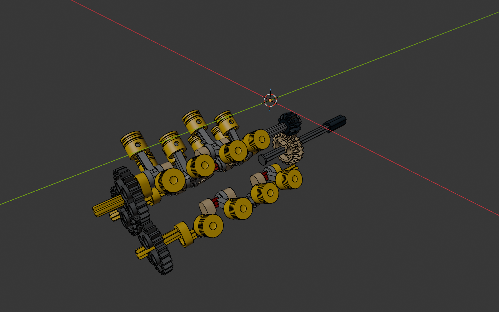
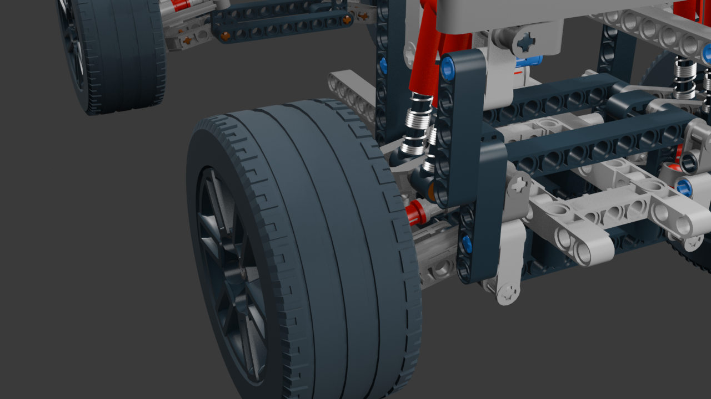
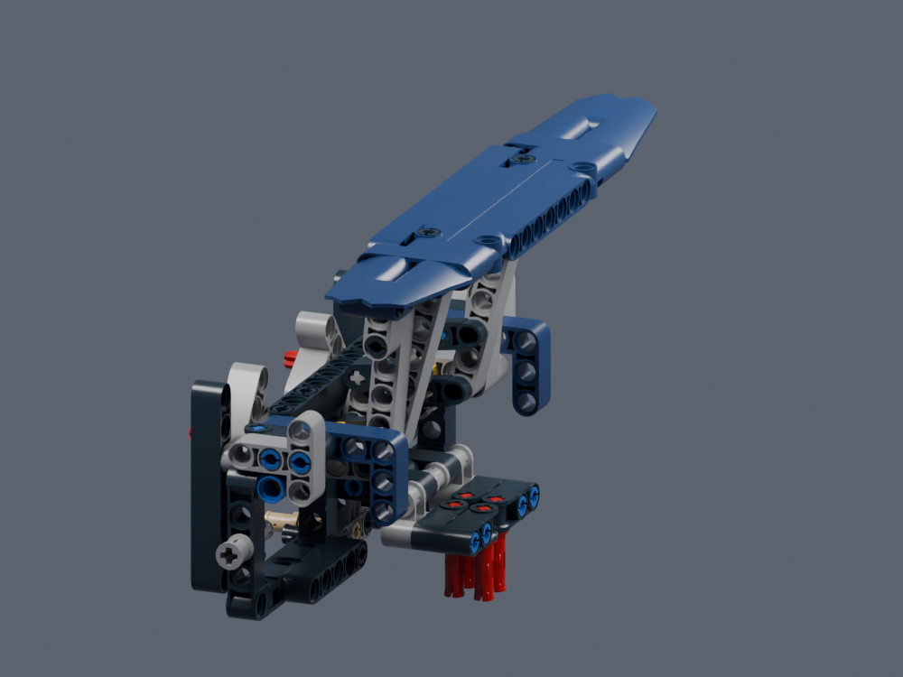

# Technic construction studies from ldraw-mecha

These local study notes adapt Technic knowledge from the sibling project's
`docs/` and `examples/` as of **2026-10-08**. Start with the
[design guide](../../docs/agent/technic-design.md), then read the relevant
pattern. The notes and three retained previews are usable without that checkout.

These are construction references, not additions to `mechanism export` or new
verified builds. Use the [mechanism atlas](../mechanism-atlas/README.md) for its
six reviewed build manuals and the [structural atlas](../technic-atlas/README.md)
for fixed-frame recipes. Analytical mechanism verification remains deferred.

For actual editable source and build pages drawn from these lessons, use the
[six new Technic-atlas mechanisms](../technic-atlas/README.md#mechanisms-from-ldraw-mecha).
Those separate prepared studies can be exported by directory after review.

| Study | Learn | Preserve the qualification |
| --- | --- | --- |
| [Chiron W16](#chiron-w16) | Multiple crankshafts, paired rods and repeated banks | Source label is wrong; preview hides fixed parts |
| [Defender drivetrain](#defender-drivetrain-and-controls) | Differentials, Cardan shafts, steering, selectors, cams and drum drive | Fixed suspension height, approximate hub spin, unimplemented rope/pawl action |
| [Standalone suspension](#standalone-defender-suspension) | Wishbones, shocks, corner interfaces and subsystem extraction | Omitted supports; no steering/drive; spring scaling is animation-only |
| [Chiron lift and selectors](#chiron-lift-and-selector-studies) | Parallelogram lift, linkage packaging, pawls and staged selection | Fixed-pivot assumption, prescribed stepper timing, two added gearbox gears |
| [Mustang discovery audit](#mustang-discovery-audit) | Finite worm engagement and investigation of missing contacts | Crank-to-frame coupling unresolved; correction policy belongs to Mecha |

## Chiron W16



Original model: Philippe Hurbain [Philo], `42083-1.mpd`, selected section
`42083 - engine.ldr`. The 223-part section contains sixteen pistons on three
crankshafts despite its V8/two-crank annotation. The image hides the fixed heads
and frame to expose the construction; the apparent unsupported pistons are
part of that cutaway presentation.

Read [engines](../../docs/agent/technic-patterns/engines.md) and
[parallel gears](../../docs/agent/technic-patterns/transmissions.md#parallel-gear-trains).
The local annotated source is available through the existing workflow:

```sh
./ldraw-agent mechanism prepare data/models-annotated/42083-1.mpd \
  --section '42083 - engine.ldr' --title 'W16 construction study' \
  --outdir output/w16-construction-study --views home top \
  --normalize-rotations --repair-bfc-comments
```

This prepares a new study, not an automatic export approval. Populate the
operation notes, open the resulting build pages, and follow
[mechanism review/export](../../docs/agent/mechanisms.md). A useful smaller
adaptation is one bank on a new engine stand, with its missing drive/supports
supplied deliberately.

## Defender drivetrain and controls

Original model: Philippe Hurbain, `42110-1.mpd`, selected section
`42110 - main.ldr`. The whole-model occurrence paths in the sibling reference
belong to this exact selection. Use `sections` and `study` to choose a bounded
subassembly before preparing build pages.

Read [transmissions](../../docs/agent/technic-patterns/transmissions.md),
[cam followers](../../docs/agent/technic-patterns/engines.md#cam-followers) and
[rack steering](../../docs/agent/technic-patterns/suspension-steering.md#rack-steering).
The source separates front/rear/centre differentials, two internal propshafts,
four-speed and range/direction selectors, a guided-follower engine, steering
and a two-mesh bevel winch. Useful adaptations include a service rover chassis,
a compact pump bank or an accessible winding control.

Its saved drivetrain does not demonstrate suspension travel, rope payout or
ratchet clicking. Hub spin uses a projection approximation and the cam/selector
profiles include assumptions. Preserve those limits when describing operation.

## Standalone Defender suspension



The sibling extract `42110-suspension-standalone.ldr` retains 259 physical parts
in the original car's frame and provides an old-to-new ID map. It is derived
from Hurbain's 42110 source, with shock shortcuts split for animation.

Read [suspension and steering](../../docs/agent/technic-patterns/suspension-steering.md).
Copy the construction idea—100-LDU outer arms, 80-LDU coupler attachments,
guided knuckles, matching half-shafts and real shock eyes—after measuring the
target parts. The imported pose is full droop. Add the omitted rack-side pin
holders and Cardan input supports before using it as a self-contained module.
Its separately studied motion is not a combined steerable, driven suspension.

## Chiron lift and selector studies



The sibling's independent extracts use `42083 - chiron.ldr`, a different frame
and occurrence namespace from the W16 engine section. The wing's paired
40-LDU cranks suggest a cargo deck that rises while staying level. Read
[lifts and linkages](../../docs/agent/technic-patterns/lifts-and-linkages.md)
before adaptation: the fixed upper axis is assumed and the platform drifts
slightly sideways. Its mounts and surrounding clearance still need construction.

The related gearbox study teaches a four-position selector with a second-stage
carry, but includes two added 12T gears. Its paddle does not independently drive
the ratchet in the saved rig. These are explicitly qualified examples; neither
the animation nor eight plausible ratios proves an unchanged official gearbox.

## Mustang discovery audit

The `10265-1_B-Model.mpd` study connects a knob, axle, single-start worm, 8T
gear and liftarm cranks. It does not resolve the cranks' contact with the rear
frame. The audit also shows how rounded rotations can hide many axle contacts.
Read [source reuse](../../docs/agent/technic-patterns/source-reuse.md) before
concluding that a sparse contact graph means the source is disconnected.

## Provenance and maintenance

[sources.json](sources.json) records exact source paths and SHA-256 hashes,
the sibling revision and local modifications, matching local model hashes, and
the unchanged copied previews. [evidence.json](evidence.json) contains selected
values from the sibling's saved review reports with JSON pointers. These are
retained observations; no motion or Blender check was rerun for this transfer.
The [transfer report](../../docs/reports/technic-knowledge-transfer.md) records
the checks actually performed here.

Supplementary originals, when the sibling checkout is present:
[reference documentation](../../../ldraw-mecha/docs/reference/README.md) and
[example artifacts](../../../ldraw-mecha/examples/reference/).
The source working tree had local edits: individual file hashes, rather than
the Git revision alone, identify the material used. Some upstream Markdown still
mentions old `output/` locations; the retained `examples/reference/` paths in
the manifest identify the actual files inspected.

Adapted from **Carlos Antelo, ldraw-mecha (2026), CC BY-SA 4.0**, as specified in
the source `ATTRIBUTION.md`. Changes: construction-focused summaries, source
qualifications, Nova workflow links and new design prompts; the three PNGs are
copied unchanged. The underlying 42083/42110 LDraw models credit Philippe Hurbain
[Philo] under CCAL 2.0. Preserve original model/part headers on any later
extraction; this documentation licence does not replace those notices.
